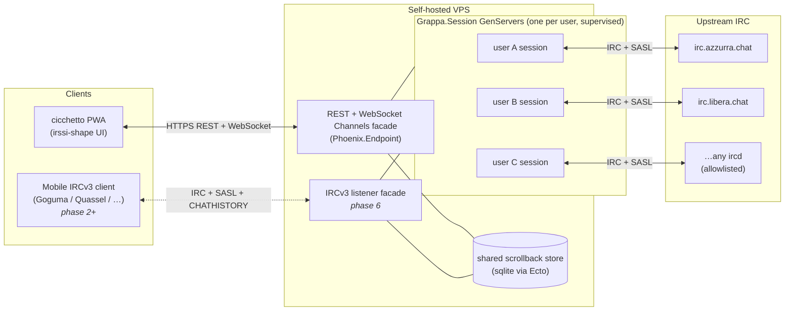

# grappa-irc

> An always-on IRC bouncer with a REST-first API and a browser PWA that looks like irssi.


## What

Two components, one monorepo:

- **grappa** — the server. Persistent bouncer, one supervised OTP process per user (Elixir/Erlang), terminates IRC at the server boundary, exposes a clean REST API plus a multiplexed WebSocket channel (Phoenix Channels) for real-time event push. SASL bridging to upstream NickServ. Self-hostable on any VPS.
- **cicchetto** — the client. A PWA that speaks pure REST. Never parses IRC. Installable on mobile home screens. Visually irssi; mobile ergonomics added on top, not instead. Built on **SolidJS + TypeScript + Vite + Bun + Biome** plus `phoenix.js` for the Channels client (decided 2026-04-26 — see [`docs/DESIGN_NOTES.md`](docs/DESIGN_NOTES.md)).

The pitch in one sentence: *modern IRC — always-on, consumable from a phone — without making it not-IRC.*

The shorter pitch, for anyone who's been on IRC >10 years: *grappa is the equivalent of irssi inside tmux, made accessible from a browser.*

### Two facades, one store

grappa exposes the same underlying state through **two facades** that share a single scrollback store:

1. **REST + WebSocket (Phoenix Channels)** — the primary surface. REST for resources, multiplexed WebSocket Channels for real-time event push. Consumed by cicchetto. IRC is fully terminated at the server; the web client is IRC-protocol-ignorant end-to-end. This is the design center.
2. **IRCv3 listener** *(phase 2+)* — a secondary, optional surface that speaks `CAP LS` + SASL + `CHATHISTORY` to existing IRCv3-capable mobile IRC clients (Goguma, Quassel mobile, etc). It is a *view* over the same store the REST surface reads from — never a second source of truth.

The two facades expose the same data. Neither introduces state the other does not. **Read state is server-owned**: per `(subject, network, channel)` cursor stored as `last_read_message_id`, advanced by cic on focus-leave + browser-blur, exposed to the IRCv3 listener facade as `+draft/read-marker` MARKREAD lines.

## Status

Pre-alpha, late stage. The server walking skeleton (Phase 1),
multi-user auth (Phase 2), client walking skeleton (Phase 3), and
most of the irssi-shape UI surface (Phase 4) have all landed and
are deployed in production for `it-opers` people. The remaining
work to **PUBLIC OPEN** is tracked in the "Trajectory to PUBLIC
OPEN" section below — six focused clusters, each shipped to the
live operator before the next begins. Self-hostable on any VPS via
Docker Compose today; not yet self-host-friendly enough for general
release (TLS verification, eviction policy, NickServ proxy, mobile
polish, public docs all pending).

## Operator quickstart

grappa runs as a single container against a sqlite DB. There is no
config file — every `(user, network)` binding lives in the DB and is
read by `Grappa.Bootstrap` at boot. The operator interface is
`bin/grappa`:

```sh
bin/grappa help                       # list every verb (boot-time + live-state + debug)
bin/grappa help <verb>                # per-verb help
bin/grappa create-user --name vjt --password ...   # mix-task verb (boot-time)
bin/grappa list-visitors              # live-state verb (--rpc-eval against the live BEAM)
bin/grappa delete-visitor <uuid>      # sync terminate Session.Server + Repo.delete
bin/grappa remote-shell               # iex --remsh into the live BEAM
```

The dispatcher routes each verb to the right transport: **boot-time
verbs** (`create-user`, `bind-network`, `add-server`, etc.) run as
mix tasks inside the container; **live-state verbs**
(`delete-visitor`, `reap-visitors`, `list-*`) attach to the live
BEAM via Erlang distribution (`elixir --rpc-eval grappa@grappa
"Grappa.Operator.<verb>(...)"`) so they introspect or mutate the
actual supervised state — no second BEAM, no port-4000 collision.
See `lib/grappa/operator.ex` for the Elixir entry points; the bash
dispatcher is a thin shell.

For inner-loop development (gates, tests, ad-hoc shells), the
sibling `scripts/*.sh` family is the developer surface — see
CLAUDE.md "Developer scripts — `scripts/*.sh`". Running tests
specifically (Elixir, cic vitest, Playwright e2e, gates, the
flake-vs-cascade-vs-real-bug triage) is documented in one place:
**`docs/TESTING.md`**.

### First deploy

1. **Clone + cd**:
   ```sh
   git clone https://github.com/vjt/grappa-irc /srv/grappa && cd /srv/grappa
   ```

2. **Generate the three required secrets**. The first `bin/grappa`
   call builds the image (~5–10 min, one-time); subsequent calls
   reuse it. Paste each output into `.env`:
   ```sh
   cp .env.example .env
   bin/grappa gen-encryption-key   # → GRAPPA_ENCRYPTION_KEY
   scripts/mix.sh phx.gen.secret              # → SECRET_KEY_BASE
   scripts/mix.sh phx.gen.secret 32           # → SECRET_SIGNING_SALT
   ```
   `GRAPPA_ENCRYPTION_KEY` encrypts upstream credentials at rest via
   Cloak AES-GCM. **Back it up separately — losing it means losing
   every stored upstream password.**

3. **Build the image + start the prod stack**:
   ```sh
   scripts/deploy.sh
   ```
   First run is always cold (no previous HEAD to diff). The container
   stays up; on a fresh DB, Bootstrap logs `bootstrap: no credentials
   bound — running web-only` and Phoenix answers `/healthz`. No IRC
   sessions are spawned until you bind a network (next section).
   When N credentials exist but all are `:parked` or `:failed`, the
   log honestly reports the state breakdown (`0 credentials in
   :connected state (N parked, M failed) — running web-only`) so
   operators don't chase "DB is empty" for a stuck network.

   On subsequent deploys `scripts/deploy.sh` auto-detects whether the
   diff is hot-safe (`Phoenix.CodeReloader` swap of running modules,
   sessions preserved) or cold-required (mix.lock / supervision tree /
   long-lived GenServer struct shape changed → image rebuild +
   force-recreate). Override flags `--force-hot` / `--force-cold` for
   the rare case where the heuristic is wrong. See CLAUDE.md for the
   full safe-change matrix.

   For cic SPA changes only (no server restart), use
   `scripts/deploy-cic.sh`: vite-builds the new bundle into
   `runtime/cicchetto-dist`, then POSTs `/admin/cic-bundle-changed` so
   connected browsers see the refresh banner immediately.

### Add an operator account + bind a network

```sh
# 1. Create the user account (REST + WS bearer-token identity).
bin/grappa create-user --name vjt --password "correct horse battery staple"

# 2. Bind a network. auth_method picks the upstream auth method:
#    auto | sasl | server_pass | nickserv_identify | none
bin/grappa add-server --network azzurra --host irc.azzurra.chat --port 6697 --tls
bin/grappa bind-network --user vjt --network azzurra \
  --nick vjt --password 'NICKSERV_PASS' --auth nickserv_identify \
  --autojoin '#italia,#hacking'

# 3. (Optional) Set per-network session caps. Visitor caps and user
#    caps are independent admission surfaces — visitor saturation
#    never blocks operator login, and vice versa (see U cluster /
#    UD1 in DESIGN_NOTES). Either flag is optional; omit for
#    unlimited. `--max-per-client N` further bounds concurrent
#    sessions from a single browser/client_id within a subject.
bin/grappa set-network-caps --network azzurra \
  --max-visitor-sessions 3 --max-user-sessions 3

# 4. Re-run scripts/deploy.sh — the cold-deploy path force-recreates
#    the container and Bootstrap picks up the new binding on boot.
#    For a no-downtime alternative, attach via `bin/grappa remote-shell`
#    and call the spawn orchestrator directly with the resolved
#    SessionPlan (lib/grappa/spawn_orchestrator.ex documents the
#    contract — Bootstrap is the canonical caller).
```

`bin/grappa help` enumerates every verb (10 boot-time + 5 live-state +
remote-shell + debug). Each verb prints `--help`-style usage via
`bin/grappa help <verb>`. Run against any DB the container can reach —
dev or prod, same dispatcher.

### Admin console (cicchetto)

Operators who want a browser surface for fleet introspection +
unblocking get a 4-tab pane in cicchetto, gated on `User.is_admin`:

- **Visitors** — list visitor sessions; inline-confirm delete to free
  cap slots (M-8, commit `e0cc028`).
- **Sessions** — every live `Session.Server` (user + visitor) with DB
  `connection_state` and live pid columns side-by-side; per-row
  Disconnect (park) + Terminate (M-9a/M-9b, commits `28edbd6` /
  `6be0bc3`).
- **Networks** — per-network cap editor with **three independent
  fields**: `max_concurrent_visitor_sessions` +
  `max_concurrent_user_sessions` (each NULL = unlimited) plus
  `max_per_client` (subject-aware bound on concurrent sessions
  from a single browser/client_id within the same subject) —
  side-by-side with live counters (visitors N/cap, users M/cap),
  partial-PATCH wire shape, plus Reset Circuit (clears
  `NetworkCircuit` ETS) and Force Reap (runs `Visitors.Reaper`
  sweep on-demand) (M-10 + U-5, commits `c86d8d8` / `010054d`).
- **Events** — real-time admin-event tail (200-entry ring buffer; 10
  typed event kinds: session lifecycle, cap changes, circuit trips,
  visitor mints/deletes) streamed over the `grappa:admin:events`
  Phoenix Channel topic (M-11, commit `418cdf1`).

There is no `--admin` flag on `grappa create-user` yet — bootstrap the
first admin via the two-step path (then any admin can promote others
from the Users tab in a future bucket):

```sh
# 1. Create the user account as usual:
bin/grappa create-user --name vjt --password "correct horse battery staple"

# 2. Promote to admin via remote-shell:
bin/grappa remote-shell --batch -e '
  user = Grappa.Repo.get_by!(Grappa.Accounts.User, name: "vjt")
  {:ok, _} = Grappa.Accounts.update_user(user, %{is_admin: true})
'
```

The Settings drawer in cicchetto shows an "Admin" entry only when the
session's bearer-token resolves to `is_admin: true`. Non-admin
sessions never see the pane and `/admin/*` REST endpoints 403 at the
`:admin_authn` plug. nginx's `infra/nginx.conf` allowlist also
gatekeeps the `/admin/*` path to admin-mounted routes (loopback
`/admin/reload` stays unreachable from the public surface).

## Why this exists

There are good IRC bouncers already. [soju](https://soju.im/) + [gamja](https://sr.ht/~emersion/gamja/) is the closest shape: a persistent Go bouncer + JS web client, both maintained by emersion, both excellent.

grappa-irc diverges on one deliberate axis: **the web client does not parse IRC**. soju and gamja communicate in IRC-framing-over-WebSocket — the client re-implements IRC protocol state in the browser. That's a principled choice and it buys standards-purity via IRCv3 extensions.

grappa makes the other choice: IRC terminates at the server, the **web** client sees only REST resources (channels, messages, members, networks) and an event stream. The browser stays ignorant of IRC. Everything the web client needs — scrollback pagination, channel modes, nick changes, join/part — arrives as typed JSON.

This also means grappa works against vanilla IRC servers. **Upstream** IRCv3 extensions are opportunistic bonuses where the upstream ircd supports them, not hard requirements. No upstream `CHATHISTORY` needed: the bouncer owns scrollback.

Separately, grappa can *expose* IRCv3 downstream to mobile IRC clients — that listener is the "two facades" design above. It re-uses the same scrollback store, so for the user it looks identical whether they open cicchetto or point Goguma at grappa.

## Architecture



- Each connected user has one persistent server-side OTP process (a supervised GenServer named `Grappa.Session`) that owns their upstream IRC connection(s). Crashes are isolated to that user; the supervisor restarts with a fresh state and the scrollback in sqlite survives.
- The process streams IRC events into a per-user paginated scrollback (sqlite-backed via Ecto, bounded by retention policy).
- The REST surface is a thin read/write layer over that state. Writes (send message, join, part) translate to upstream IRC commands; reads return typed JSON.
- New events push to connected clients over a multiplexed WebSocket connection (Phoenix Channels) — one socket per browser tab, many topic subscriptions per socket (`grappa:network:{net}/channel:{chan}`). Disconnected clients reconnect transparently via `phoenix.js` and catch up on missed messages via paginated scrollback endpoints.

## Design principles

1. **No IRC parsing in the web client. Ever.** REST is the contract for cicchetto. The browser never sees a raw `PRIVMSG`. Mobile IRC clients talking to the optional IRCv3 listener are a separate case — they parse IRC by definition, that's what they are.
2. **Upstream IRCv3 is opportunistic, not required.** grappa works against any ircd that speaks `CAP LS` + SASL. Fancy upstream extensions are bonuses. *Downstream* (toward IRCv3 mobile clients) grappa will speak `CAP` + SASL + `CHATHISTORY` fully, because that's the point of the second facade.
3. **Scrollback is bouncer-owned.** One store, paginated API for REST, `CHATHISTORY` mapping for the IRCv3 listener. No dependency on upstream server-side `CHATHISTORY`.
4. **Auth is NickServ.** Login via SASL handshake against upstream. Registration proxied through a dedicated endpoint.
5. **Self-hostable.** Any VPS. sysadmin-configurable allowlist for upstream IRC servers.
6. **Irssi-shape on desktop, irssi-shape on mobile too.** Large screens nearly identical to irssi (themes + keybindings). Mobile keeps the same visual grammar but adds touch-ergonomic helpers (channel switcher, tap targets, soft keyboard handling). No chat-app metaphor — it's still IRC.
7. **No images, no voice messages, no file sharing.** It's IRC. Those problems belong to someone else. *Voice I/O on the client* (read-aloud + dictate) is a separate, in-scope accessibility feature — see below. The wire stays text.
8. **No mobile push infrastructure.** If the browser's PWA push API is available, we use it. Otherwise, no notifications. We don't run notification servers.
9. **Accessibility is a client concern, not a server feature.** Server stays protocol-clean; the PWA is where screen-reader support, TTS, STT, and touch-ergonomic helpers live. Lift lands in cicchetto, not grappa.

### Client-side voice I/O (cicchetto)

Optional, opt-in, per-channel toggle in cicchetto — **no voice ever touches grappa or the IRC wire**:

- **TTS** — incoming messages read aloud via the browser's `SpeechSynthesis` API. Uses OS voices (Android, iOS, macOS, Windows).
- **STT** — compose by voice via `SpeechRecognition` (Chrome/Edge native; Firefox partial; Safari supported on modern iOS).
- **Offline path** — optional drop-in of [Vosk](https://alphacephei.com/vosk/) WASM for STT and [piper](https://github.com/rhasspy/piper) (or equivalent) for TTS, for users who don't want recognition routed through a cloud. Bundle-size cost is paid only if enabled.
- **Server cost: zero.** Feature is implemented entirely in the PWA.

This unblocks the Android-IRC-with-voice ask that today has no good answer — no existing Android IRC client ships native TTS/STT. The only workarounds are screen readers (TalkBack reading the chat window) or external glue (Tasker intercepting notifications, Termux + weechat-relay wrappers). A PWA with Web Speech is a cleaner shape.

## REST surface (first draft)

All endpoints are authenticated except `POST /auth/login` and `POST /auth/register`.

| Method | Path | Purpose |
|--------|------|---------|
| `POST` | `/auth/login` | SASL-bridged login against a configured upstream network |
| `POST` | `/auth/register` | Proxy NickServ `REGISTER` on upstream |
| `POST` | `/auth/logout` | Invalidate session |
| `GET`  | `/me` | Current session info |
| `GET`  | `/networks` | Configured networks for current user |
| `POST` | `/networks` | Add a network binding |
| `PATCH` | `/networks/:net` | Update a network binding. T32: accepts `{connection_state: "connected" \| "parked", reason?}` to park/unpark a network without unbinding. `:failed` is server-set only (lenient: k-line / permanent SASL fail), rejected from this endpoint. |
| `DELETE` | `/networks/:net` | Remove a network binding |
| `GET`  | `/networks/:net/channels` | Joined channels on that network |
| `POST` | `/networks/:net/channels` | Join a channel |
| `DELETE` | `/networks/:net/channels/:chan` | Part |
| `GET`  | `/networks/:net/channels/:chan/messages?before=<ts>&limit=N` | Paginated scrollback |
| `POST` | `/networks/:net/channels/:chan/messages` | Send |
| `GET`  | `/networks/:net/channels/:chan/members` | Nicks + modes |
| `GET`  | `/networks/:net/archive` | Archived windows: targets with scrollback rows that are NOT currently active (joined channels + open queries excluded). Powers cicchetto's per-network collapsed Archive section. `$server` always excluded. |
| `POST` | `/networks/:net/raw` | Escape hatch: send a raw IRC line |
| `WS`   | `/socket/websocket` | Phoenix Channels endpoint (multiplexed pub/sub) |

Real-time events arrive over a Phoenix Channel joined per-topic:

| Topic | Events |
|-------|--------|
| `grappa:user:{user}` | session-wide: network connect/disconnect, global notices |
| `grappa:network:{net}` | per-network: motd, server notices, nick changes |
| `grappa:network:{net}/channel:{chan}` | per-channel: message, join, part, mode, topic, notice |

Events are typed JSON — `message`, `join`, `part`, `quit`, `nick`, `mode`, `topic`, `notice`, etc. The client updates its local state from these; it does not need to reason about IRC framing. Reconnect, replay-on-resubscribe, and presence are handled by the `phoenix.js` client library.

## Slash commands (cicchetto)

Typed in the compose box. Parsed client-side; dispatched to REST or IRC depending on the verb. Unknown verbs surface as inline errors.

| Verb | Effect |
|------|--------|
| `/me <text>` | CTCP ACTION in the active channel |
| `/join <#chan>` | Join a channel |
| `/part [#chan] [reason]` | Part the active or named channel |
| `/topic <text>` | Set topic on the active channel |
| `/topic -delete` | Clear the topic (irssi convention) |
| `/nick <newnick>` | Change nick on the active network. Works for users (operator nick) and visitors (anonymous + NickServ-identified) — visitor branch pre-checks `Visitors.nick_in_use?/3` then UNIQUE-constraint-protects on persist. |
| `/msg <nick> <text>` | Send a private message (opens query window) |
| `/query <nick>` / `/q <nick>` | Open a query window without sending |
| `/whois <nick>` | Issue WHOIS; reply renders inline as a card in the active window with structured fields (user, host, realname, server, away, idle, signon, channels, plus typed flags: oper / admin / services-admin / services-agent / helper / chanop / registered / SSL / java). All human-readable strings owned by cic per the no-localized-strings-server-side rule. |
| `/whowas <nick>` | Issue WHOWAS; reply renders inline as a card with the most-recent historical entry (user, host, realname, last-seen-server, logoff-time). 406 ERR_WASNOSUCHNICK renders as a "no history" surface in the same card. Visitor-allowed. |
| `/who <#chan>` | Issue WHO on a channel; replies render as scrollback rows in the target channel (joined) or `$server` (otherwise). Each 352 RPL_WHOREPLY → one `:notice` row; the 315 RPL_ENDOFWHO terminator row marks end. |
| `/names <#chan>` | Issue NAMES on a channel. Joined target → MembersPane refresh via the `members_seeded` push (no scrollback rows). Non-joined target → 2 `:notice` rows in `$server` (full nick list + EOF terminator). |
| `/lusers` | Issue LUSERS; reply renders as a card pinned in the `$server` window with structured network-state fields (total users, invisible, operators, channels, servers, local/global counts). Auto-emitted on connect-welcome too. Last-write-wins; closeable. Visitor-allowed. |
| `/op <nick>...` / `/deop <nick>...` | `MODE +o` / `MODE -o` on the active channel; multi-target chunked per ISUPPORT `MODES=` |
| `/voice <nick>...` / `/devoice <nick>...` | `MODE +v` / `MODE -v` on the active channel |
| `/kick <nick> [reason]` | KICK on the active channel |
| `/ban <nick-or-mask>` / `/unban <mask>` | `MODE +b` / `MODE -b`; bare nick → `*!*@host` derived from WHOIS-userhost cache, fallback `nick!*@*` |
| `/banlist` | `MODE #chan b`; replies render inline (planned: clickable for one-tap unban) |
| `/invite <nick> [#chan]` | INVITE; active channel by default. Server's 341 RPL_INVITING ack renders as a synthetic row in the always-visible `$server` window (aggregates across all target channels invited to on the network). |
| `/umode <modes>` | Set user-mode flags on own nick |
| `/mode <target> <modes> [args]` | Raw `MODE` pass-through (escape hatch; no chunking applied) |
| `/away [reason]` | Set explicit away with an optional reason. Bare `/away` (no reason) clears explicit away status. |
| `/watch add <pattern>` | Add pattern to watchlist (alias: `/highlight add`). Replies with updated list inline. |
| `/watch del <pattern>` | Remove pattern from watchlist (alias: `/highlight del`). |
| `/watch list` | Show current watchlist (alias: `/highlight list`). |
| `/quit [reason]` | Nuclear logout: parks **all** bound networks (`PATCH /networks/:net` with `connection_state: "parked"`), QUITs each upstream, closes the WS, clears auth, redirects to `/login`. Re-login + `/connect <net>` to bring networks back. |
| `/disconnect [network] [reason]` | Park one network (active-window's network if no arg). Bouncer stays parked across reboots until `/connect`. Visitor sessions: aliases to `/quit` (visitor credentials are ephemeral). |
| `/connect <network>` | Unpark + respawn the named network. Works from `:parked` or `:failed`. |

### Channel-window header (C3)

Every channel window pins a header strip showing the topic (single-line, ellipsized — click to expand modal with full topic + setter nick + set-at timestamp) and a compact mode-string like `+nt` (hover for full mode list). Empty topic renders `(no topic set)` so the strip space is constant. Header is channel-only — query, server, and pseudo-windows have no topic strip.

On JOIN, the channel window auto-focuses (own-nick JOIN is a user-action focus shift per the C4 focus rule). Topic + members are already surfaced by the TopicBar and the right-pane MembersPane — there is no extra "you've joined #chan" splash row (a one-time strip with topic + names existed pre-UX-5 BJ; it duplicated both surfaces and stole vertical space on large channels — killed 2026-05-19).

### DM (query) windows + focus rule (C4)

Private messages get per-user "query" windows in the sidebar, persisted across logins/devices on the server (`query_windows` table, see C1). Three ways to open one:

- **`/msg <nick> <text>`** — opens the query window, switches focus to it, and sends the message.
- **`/query <nick>`** / **`/q <nick>`** — opens the window and switches focus, no message sent.
- **Incoming PRIVMSG from a sender with no existing query window** — auto-opens the window in the sidebar **but does NOT switch focus** (the unread badge bumps; the user clicks to switch).

**Cluster-wide focus rule:** focus changes only on user actions (`/join` self, `/msg` `/query` `/q`, click on tab, click on nick). Incoming traffic — PRIVMSG, JOIN, PART, QUIT, MODE, autojoin window auto-creation — never steals focus. Enforced by invariant tests in `cicchetto/src/__tests__/focus-rule.test.ts`.

### Archive section (CP15 B4)

Each network section in the sidebar gets a collapsed `<details>` "Archive" beneath the active windows. Lists targets with scrollback rows that are NOT in the active set (joined channels + open queries). Sourced from `GET /networks/:slug/archive`, lazy-fetched on first expand. Each entry is clickable: opens the read-only window for past channels (re-JOIN via `/join` from compose) or revives the query window for past DMs. `$server` is system surface — always active, never archived. The active/archive boundary is **user-action driven** (PART or window-close → archived; KICK or T32 disconnect keeps the window in active sidebar, greyed). The rendered list is **filtered at render time** to drop entries that have been re-activated since the lazy fetch (operator JOINs an archived channel → it disappears from archive on the same tick the live row appears in active).

### Window state model (CP15 B5)

`cicchetto/src/lib/windowState.ts` mirrors the server-side window-state machine (`Grappa.Session.Server`'s `window_states` + `window_failure_{reasons,numerics}` + `window_kicked_meta` maps). Three module-singleton signal stores keyed on `(networkSlug, channelName)`:

- `windowStateByChannel`: `"pending" | "joined" | "failed" | "kicked" | "parked"` — absence = archived.
- `windowFailureByChannel`: `{reason, numeric}` for `:failed` (471/473/474/475/403/405).
- `windowKickedMetaByChannel`: `{by, reason}` for `:kicked`.

The server emits typed events on the per-channel topic — `kind: "joined" | "join_failed" | "kicked"` — that `cicchetto/src/lib/subscribe.ts` dispatches to the matching setter. `:parted` is intentionally NOT broadcast: its projection is "key removed from windowStateByChannel" (cic derives it from the existing `:part` presence message when `sender === ownNick`).

Render branches:

- **MembersPane** branches on `windowStateByChannel[key]`: state ∉ {joined} → "not joined" muted text; state == joined && empty → "loading…" muted; state == joined && filled → render the list. The pre-B5 `loadMembers` REST gate went away — server pushes `members_seeded` on after_join (CP15 B3) AND on every 366 RPL_ENDOFNAMES, so cic has no remaining reason to fetch `GET /members`.
- **ComposeBox** adds `.compose-box-greyed` + "(not joined)" inline label when state ∈ {failed, kicked, parked}. Compose stays functional — the operator can still type `/join` / `/part` to recover.
- **Sidebar** adds `.sidebar-window-greyed` to channel + query rows whose state ∈ {failed, kicked, parked}. Synthetic sidebar row whenever `windowStateByChannel` carries the key but `channelsBySlug` doesn't — covers `:pending` (just-typed `/join`, awaiting upstream echo, `.sidebar-window-pending`) AND the three non-joined post-state cases `failed | kicked | parked` (greyed). Without the synthetic row a failed JOIN to an invite-only channel or a KICK from a room you'd previously left in `channelsBySlug` would have NO sidebar entry at all. When the typed `joined` event lands, `channelsBySlug` refetches via the `channels_changed` heartbeat and the row continues life under the channelsBySlug branch.

`/join` from compose calls `setPending(channelKey)` immediately for visual feedback. The pending entry also pre-subscribes the per-channel Phoenix topic (one createEffect iterates `windowStateByChannel()` for `"pending"` entries) so the upstream JOIN echo broadcast lands on a live subscriber — closing the race where Phoenix PubSub would drop broadcasts to a topic cic hadn't yet joined.

The full window-state transition matrix is e2e-covered as of CP15 B6: `cicchetto/e2e/tests/cp15-b6-*.spec.ts` exercises `pending → joined`, `pending → failed` (invite-only), `joined → kicked`, `joined → parted → archive → re-joined`, and the archived-query revival cycle against the real Bahamut testnet via `scripts/integration.sh`.

### Mobile layout (C6)

At viewports ≤768px (`--breakpoint-mobile`) cicchetto switches to a mobile-first layout:

- **Bottom tab-bar** (under the compose input): horizontally scrollable strip of all windows, grouped by network with a network-name chip. Ordering within each network: Server → channels → query/DM windows. Unread and mention badges render inline. Replaces the left sidebar for navigation on mobile.
- **Single hamburger** (right-side, in the topic bar): toggles the members/nicks slide-in drawer. The left channel-sidebar hamburger is removed on mobile — channels are navigated via the bottom tab-bar.
- **Full-width scrollback** — no left/right panes; compose and bottom-bar sit below it.
- Desktop three-pane layout (sidebar | scrollback | members) is completely unchanged above 768px.

The breakpoint is mirrored in TypeScript as the `isMobile()` reactive signal in `cicchetto/src/lib/theme.ts`.

### Scrollback polish (C7)

Seven visual and UX improvements to the message history pane:

- **Day separators (C7.1)** — when consecutive messages cross a local-timezone day boundary, a `── <weekday, month day> ──` rule is injected between them. Computed entirely client-side from `server_time` (epoch-ms).
- **Muted events (C7.2)** — JOIN / PART / QUIT / NICK / MODE / TOPIC / KICK lines are rendered at 85% font-size and 0.75 opacity. PRIVMSG / NOTICE / ACTION lines stay full-contrast so content dominates.
- **Unread marker (C7.3)** — on focus switch to a channel, a `── unread ──` rule is inserted before the first message received after your last visit. Position is computed from the server-side per-`(network, channel)` read-cursor (synced cross-device via the `Topic.user/1` `read_cursor_set` broadcast). The marker collapses on the next render whenever the cursor advances past it — including sending a message in the currently-focused window, not just on focus-leave.
- **Scroll-to-bottom button (C7.4)** — a `↓` floating button appears when scrolled more than 50px from the tail. Clicking it smooth-scrolls to the bottom and resumes auto-follow.
- **Msg vs events badges (C7.5)** — unread indicators split into two counters: **messages** (PRIVMSG / NOTICE / ACTION → bold accent badge) and **events** (JOIN / PART / QUIT / NICK / MODE / TOPIC / KICK → dimmer muted indicator). Both derive from `(scrollback, read-cursor, /me seed)` — no incremental bump store; recomputing the count from the cursor is the single source of truth. Cross-device sync falls out for free: send in tab A, tab B's badge for the same channel does NOT bump (tab A's cursor write fans on `Topic.user/1`, tab B's memo recomputes past it). Both desktop Sidebar and mobile BottomBar show the split.
- **Clickable nicks (C7.6)** — sender buttons in PRIVMSG / NOTICE / ACTION lines are interactive: left-click opens a query (DM) window and switches focus; right-click shows the same `UserContextMenu` as the members pane (op/deop/voice/kick/ban/WHOIS/query). Zero new components.
- **Watchlist highlight (C7.7)** — PRIVMSG / NOTICE / ACTION lines where the body matches the watchlist get `.scrollback-highlight` (soft accent left-border). MVP: watchlist = own nick only. Named separately from `.scrollback-mention` so a future `/watch` verb can extend it to a configurable nick list without touching the mention rendering path.

### Mentions window + watchlist (C8)

Three features shipped together:

- **Mentions-while-away window (C8.1)** — when returning from away (explicit or auto), the server aggregates all PRIVMSG/NOTICE/ACTION lines whose body matches the watchlist during the away interval and broadcasts a `mentions_bundle` event on the user-level Phoenix Channel. Cicchetto receives this, stores the bundle, and auto-opens a `:mentions` pseudo-window in the channel pane. The window shows a header with count, away interval, and reason, then one clickable row per message (time · channel · sender · body). Watchlist matches render with `.scrollback-highlight`.
- **Click-to-context (C8.2)** — clicking a row in the mentions window sets the read-cursor to `serverTime - 1` and switches focus to the source channel. ScrollbackPane's existing unread-marker scroll infrastructure (C7.3) positions the view just above the referenced message.
- **Away indicator + watchlist verbs (C8.3)** — the Sidebar now shows a `[away]` badge next to any network where the user is currently away (driven by the server's `away_confirmed` event). `/watch` and `/highlight` (synonyms) are now real rather than stubs: they push to the server's `watchlist` channel handler and display the updated pattern list inline. Three sub-verbs: `add <pattern>`, `del <pattern>`, `list`.

Watchlist is forward-only: changing patterns does not re-aggregate past scrollback; only future messages are filtered against the new list.

| Verb | Effect |
|------|--------|
| `/watch add <pattern>` | Add pattern to watchlist; replies with updated list |
| `/watch del <pattern>` | Remove pattern from watchlist |
| `/watch list` | Show current watchlist |
| `/highlight …` | Alias for `/watch …` |

Right-click any nick in the members pane to open a context submenu. Items:

| Action | Command | Requires |
|--------|---------|----------|
| **Op** | `MODE #chan +o nick` | `@` op |
| **Deop** | `MODE #chan -o nick` | `@` op |
| **Voice** | `MODE #chan +v nick` | `@` op |
| **Devoice** | `MODE #chan -v nick` | `@` op |
| **Kick** | `KICK #chan nick` | `@` op |
| **Ban** | `MODE #chan +b nick!*@*` | `@` op |
| **WHOIS** | `WHOIS nick` | — |
| **Query** | open DM window | — |

Items requiring `@` are shown **greyed out** (not hidden) when you lack the mode — irssi convention. WHOIS and Query are always enabled.

IRC numeric replies from the upstream server (error 482 "not an operator", 401 "no such nick", etc.) are routed back to the window that triggered them and displayed as ephemeral inline lines **below the scrollback**. Failure-class numerics (IRC codes ≥ 400) render in **red** using the existing `--mode-op` red token; info-class numerics render in muted color.

### Auto-away (S3)

When the last browser tab closes (or sends a `pagehide` / `beforeunload` hint), grappa starts a **30-second debounce timer**. If no tab reconnects within that window, the bouncer sends `AWAY :auto-away (web client disconnected)` upstream on every connected network. When a tab reconnects the timer is cancelled and (if auto-away was active) `AWAY` is cleared immediately.

Explicit `/away` takes precedence: once set, auto-away does **not** overwrite it and a tab reconnect does **not** clear it. Only `/away` (bare, no reason) clears explicit away status.

Away state machine: `:present → :away_auto` (web disconnect + 30s) → `:present` (tab reconnect). `:away_explicit` is an independent state set/cleared only by the user; reconnecting a tab does not touch it.

### `connection_state` model (T32)

Each network binding carries a `connection_state` enum:

| State | Set by | Bootstrap | User action |
|-------|--------|-----------|-------------|
| `:connected` | default; `/connect`; `PATCH connection_state=connected` | spawns the session | `/disconnect` to park |
| `:parked` | `/disconnect`; `PATCH connection_state=parked` | **skips** the session | `/connect` to unpark |
| `:failed` | server-set on hard upstream failure (k-line / permanent SASL) | **skips** the session | `/connect` to retry |

Transient errors (timeout, refused, DNS, max-backoff) keep the session in continuous reconnect with `:connected` — the bouncer's job is to keep trying. `:failed` is reserved for *terminal* failures where retry is futile. The `connection_state_reason` and `connection_state_changed_at` columns expose the cause + when the transition happened, surfaced in cicchetto's server-messages window.

### Image upload (I cluster, 2026-05-15)

Cicchetto can upload images to a third-party host and post the resulting URL as a regular IRC PRIVMSG. The wire stays text-only — the server, the IRC protocol, and any IRCv3 listener client all see a normal message; only cic renders the link as clickable. Pluggable `ImageHost` interface (`cicchetto/src/lib/image-upload.ts`) ships with a litterbox.catbox.moe implementation and is shaped to fit imgur / 0x0.st / catbox-permanent next. Default TTL is 24h (litterbox's `1h | 12h | 24h | 72h` knob, server-side expiry — no cic deletion). Four trigger surfaces: 📸 button in the compose box, mobile camera capture (`<input type=file accept=image/* capture=environment>` on ≤768px), drag-drop onto the compose area, and clipboard paste. Wire shape is `📸 https://litter.catbox.moe/abc.png` — single emoji prefix, no IRC tags, no client-side detection magic. First-upload-per-host shows a privacy-acknowledgement modal (per-host localStorage key); subsequent uploads are silent. Render contract: clickable links via the existing `linkify` path, no inline thumbnails, no lightbox — IRC stays text only (see CLAUDE.md Engineering Standards → Code-shape rules).

## Scope

**In scope:**
- Text chat on IRC. Channels, queries, notices, CTCP ACTION.
- Multi-network per user.
- Persistent scrollback with pagination.
- NickServ authentication bridging.
- PWA that works on phones without an app-store detour.
- Self-hosting for individuals and small groups.

**Out of scope:**
- File sharing (DCC, HTTP uploads, anything).
- Voice, video, audio messages.
- Inline image/video/link unfurling beyond a URL as text.
- Running as a hosted multi-tenant SaaS. Self-hosted only.
- Push notification servers. PWA push only if the browser provides it.
- Being kinder to the ircd than the ircd is to itself.

## Prior art (read for behavior, not imported)

- [**soju**](https://soju.im/) — SASL bridging, scrollback ring-buffers, reconnect/backoff policy, multi-network management. The reference for "what a correct bouncer does".
- [**gamja**](https://sr.ht/~emersion/gamja/) — web-client login UX, channel-switch flow, PWA manifest. Visually not our target (chat-app shape), but the flows are instructive.
- [**The Lounge**](https://thelounge.chat/) — another working PWA reference. Bundles server + client, which is not our split, but the manifest + service-worker setup is canonical.
- [**IRCCloud**](https://www.irccloud.com/) — the commercial mobile-IRC UX north star. A "done" version of the experience we're aiming for.
- [**ZNC**](https://znc.in/) — the classic. Not an architectural reference, but every bouncer exists in dialogue with ZNC.

None of the above is being forked or imported. grappa is greenfield. The value here is reading their code for edge cases (retry logic, SASL negotiation nuances, scrollback eviction policy) and designing around the lessons.

## Why "grappa" and "cicchetto"

"Grappa" is Italian distillate — the direct homologue of Korean *soju*. "Cicchetto" is the small glass of wine, often accompanied by a bite, served at a *bàcaro* (a Venetian-style neighbourhood wine bar); parallel to *gamja*, the potato that accompanies soju in Korea. The naming is a deliberate riff on soju/gamja.

It is also a tribute: **Italian Grappa!** has been the call-sign of the [Italian Hackers' Embassy](https://events.ccc.de/camp/2019/wiki/Village:Italian_Hackers'_Embassy) at European hacker camps since 2001. The [Associazione Inclusive Hacker Framework](https://italiangrappa.it/) is the legal entity that carries the name today. This repository is not affiliated with that association; it borrows the cultural reference in the spirit it was intended — Italian hackers showing up somewhere with a bottle.

## Roadmap

### Phase 0 — spec
- [x] README
- [x] Server language: **Elixir/OTP + Phoenix** (decided 2026-04-25 — see [`docs/DESIGN_NOTES.md`](docs/DESIGN_NOTES.md))
- [ ] OpenAPI schema for the REST surface
- [x] Client framework: **SolidJS + TypeScript + Vite + Bun + Biome** (decided 2026-04-26 — see [`docs/DESIGN_NOTES.md`](docs/DESIGN_NOTES.md))

### Phase 1 — server walking skeleton ✓
- [x] Single-user bouncer, single upstream network, hardcoded credentials
- [x] Basic REST: `/networks`, `/channels`, `/messages` (paginated)
- [x] Phoenix Channel for `grappa:network:{net}/channel:{chan}` event push
- [x] sqlite-backed scrollback (Ecto + ecto_sqlite3)
- [x] Send + receive `PRIVMSG` round-trip
- [x] OTP supervision tree: one `Grappa.Session` GenServer per user under `DynamicSupervisor`

### Phase 2 — auth + multi-user ✓
- [x] SASL bridge for login (Cloak-encrypted upstream creds, `:auto | :sasl | :server_pass | :nickserv_identify | :none`)
- [ ] NickServ `REGISTER` proxy
- [x] Session tokens (Argon2-hashed password → bearer-token sessions, sliding 7-day idle)
- [x] Per-user isolation (cross-user join authz at the channel layer)
- [x] Two-tier visitor identity model: anonymous (48h sliding TTL, data co-terminus with session) + NickServ-identified (infinite, `expires_at = NULL` written when upstream confirms `+r`). Returning identified visitors re-authenticate with their NickServ password and reuse their existing visitor row across devices. Visitor surface is feature-equal with the registered-user surface (CP32 visitor-parity cluster, 2026-05-15) — see [`docs/DESIGN_NOTES.md`](docs/DESIGN_NOTES.md) for the parity invariant.
- [x] Visitor session sharing via one-time link (2026-05-31). Settings → "share session" mints a 10-minute Phoenix-signed token; opening the link on a second device redeems it through `POST /auth/share/consume` and lands a fresh bearer for the SAME visitor row — both devices stay connected (sharing, not transfer). One-shot semantics enforced by `Grappa.Visitors.ShareTokens`'s ETS ledger (`:ets.insert_new/2`). User subjects get 403 — feature is meaningless for password-holding identities.

### Phase 3 — client walking skeleton ✓
- [x] PWA shell, manifest, service worker
- [x] Login flow → token → connect `/socket/websocket`
- [x] Channel list + scrollback fetch on select
- [x] Send message
- [x] Production deploy (nginx + DNS register + iPhone PWA install round-trip)

### Phase 4 — irssi-shape UI ✓ (most surface)
- [x] Keyboard-first layout, theme system
- [x] Nick list, mode indicators, topic bar
- [x] Mobile ergonomics layer (touch helpers, not a different shape) — full mobile-polish cluster still pending (see "UI polish" below)
- [ ] Client-side voice I/O — moved to its own cluster (see "Voice TTS+STT" below)

### Phase 5 — hardening (in flight)
- [x] Reconnect + backoff (T31 — admission caps + per-network circuit breaker + per-session ±25% jitter)
- [ ] Scrollback eviction policy
- [x] Allowlist configuration for upstream networks (admission cap dimensions)
- [ ] TLS verification (replace `verify: :verify_none` with proper CA chain — Phase 5 P-2)
- [x] Sobelow promotion + tightened prod gate (folded into CP31 no-silent-drops cluster B6.x; closed 2026-05-14)
- [ ] Docs for self-hosters

### Phase 6 — IRCv3 listener facade
- [ ] Downstream `CAP LS` + SASL, identity bridged to the same session the REST surface uses
- [ ] Map paginated scrollback to `CHATHISTORY` (`BEFORE`, `AFTER`, `BETWEEN`, `LATEST`)
- [ ] `server-time`, `message-tags`, `batch`, `labeled-response`
- [ ] Drop-in compatibility target: [Goguma](https://sr.ht/~emersion/goguma/), [Quassel](https://quassel-irc.org/), [mIRC 7.64+](https://www.mirc.com/) with IRCv3 support
- [ ] Expose the server-owned read cursor as `+draft/read-marker` MARKREAD lines on the listener side (REST + IRCv3 share the same `last_read_message_id` per `(subject, network, channel)`)


## Trajectory to PUBLIC OPEN

The project is past Phase 1-3 and most of Phase 4. The road to
**PUBLIC OPEN** is a sequence of focused clusters, each shipped to
the live operator before the next begins. Current order:

1. **Voice TTS+STT (Web Speech API on-device)** — per-channel TTS +
   STT toggle via the browser's Web Speech API. On-device, no third-
   party round-trip; Vosk/piper WASM offline path stays as the
   long-tail fallback for browsers without Web Speech support.
2. **UI polish cluster** — its own multi-bucket effort, mobile-first.
   Mobile UX needs a real pass: responsive breakpoints beyond the
   single 768px line, touch-target sizing, sidebar ergonomics, input
   bar density, scroll behavior. The current mobile layout is
   functional but not polished.
3. **PUBLIC OPEN** — the milestone where grappa stops being a
   single-operator setup hosting `it-opers` people and becomes a
   self-hostable bouncer anyone can deploy. Pre-conditions: every
   cluster above CLOSED, Phase 5 hardening done (TLS verification,
   eviction policy, NickServ proxy), self-hoster docs, OpenAPI
   schema published.

Recently closed (per-cluster history with bucket-level detail in
[`docs/DESIGN_NOTES.md`](docs/DESIGN_NOTES.md)): bastille deploy
(FreeBSD jail prod runtime, live on m42 since 2026-05-27),
unread-badges-from-cursor (msg/events counters derive from
`(scrollback, cursor, seed)` + cross-device sync), e2e flake triage,
UX-8 scroll cluster, wireTypes.ts codegen, BUGHUNT-1/2/3
pre-bastille bug-hunt.

Beyond PUBLIC OPEN, Phase 6 IRCv3 listener facade is the long-tail
work — drop-in compatibility with existing IRCv3 mobile clients
without giving up any of the REST/Channels surface.

## Contributing

Pre-alpha, pre-PUBLIC-OPEN. Issues welcome for design feedback;
code PRs welcome once the cluster trajectory above closes (the
multi-user surface is still moving fast and PR review against a
moving target wastes both sides).

## Why this exists (the longer story)

This project has a motive, not just an architecture. Three posts are the backstory:

- **2002 — [Forking Bahamut for Azzurra IRC: IPv6 and SSL in 2002](https://sindro.me/posts/2026-04-13-bahamut-fork-azzurra-irc-ipv6-ssl/)** — how a 21-year-old ended up forking an IRC server to add IPv6 and SSL because the Italian IRC network he'd fallen in love with needed it. The DNA of why IRC, specifically, and why Azzurra, specifically.
- **2002–2005 — [Sux Services: Multithreaded, SQL-Backed IRC Services from Scratch, 2002](https://sindro.me/posts/2026-04-14-suxserv-multithreaded-sql-irc-services/)** — the sequel: writing IRC services from scratch in C, with real threading and a real SQL backend, because the off-the-shelf ones weren't good enough. Same instinct that drives grappa: if the existing thing is almost right but not quite, write the thing.
- **2026 — [Claude walks into #it-opers](https://sindro.me/posts/2026-04-17-claude-walks-into-it-opers/)** — how, twenty-four years later, the same crew is still on the same network, still in the same channel, and a Claude Code session was bridged into IRC as `vjt-claude`. The evening that surfaced the "we should just do this" for grappa.

The throughline:

- **Nostalgia**, honestly admitted. Azzurra is still alive. The nick and channel databases have been preserved across multiple network "earthquakes"; the servers and services kept running; the infrastructure cared for by people who still want it to be there. Individuals come and go — but *the spirit carries on*. **That** is the persistence worth investing in — the network itself, not any single nick — and it is a feature, not a nostalgia trap.
- **A general preference for self-hosted chat platforms** over whatever-SaaS-is-ascendant-this-year. Matrix, XMPP, IRC, the whole family. IRC's particular virtue is that the protocol is 30 years old, doesn't care about you, and will keep working when the vendor in question pivots or dies.
- **A preference for text-only communication** over the modern overloaded stuff. No unfurls, no reactions stacked on reactions, no threaded-inside-threaded, no "is-typing" indicators, no presence surveillance. Just text. What the brain wants to be reading at 23:00 after a day on Teams.

grappa isn't a product pitch. It's a tool built for a specific set of people who still want to use IRC on a phone in 2026, and who would rather self-host it than rent it.

## License

MIT — see [`LICENSE`](LICENSE).

## Author

[vjt](https://github.com/vjt) (Marcello Barnaba), who built [bahamut-inet6](https://github.com/vjt/azzurra-bahamut-inet6) and [suxserv](https://github.com/vjt/azzurra-suxserv) for the [Azzurra IRC network](https://www.azzurra.chat/). grappa-irc is the 2026 attempt at making Azzurra — and any IRC network — liveable on a phone.
