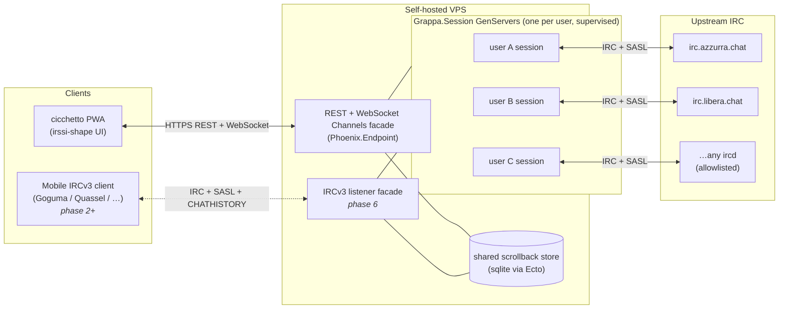

# grappa-irc

> An always-on IRC bouncer with a REST-first API and a browser PWA that looks like irssi.


## What

Two components, one monorepo:

- **grappa** — the server. Persistent bouncer, one supervised OTP process per user (Elixir/Erlang), terminates IRC at the server boundary, exposes a clean REST API plus a multiplexed WebSocket channel (Phoenix Channels) for real-time event push. SASL bridging to upstream NickServ. Self-hostable on any VPS.
- **cicchetto** — the client. A PWA that speaks pure REST. Never parses IRC. Installable on mobile home screens. Visually irssi; mobile ergonomics added on top, not instead. Built on **SolidJS + TypeScript + Vite + Bun + Biome** plus `phoenix.js` for the Channels client (decided 2026-04-26 — see [`docs/DESIGN_NOTES.md`](docs/DESIGN_NOTES.md)).

The pitch in one sentence: *modern IRC — always-on, consumable from a phone — without making it not-IRC.*

The shorter pitch, for anyone who's been on IRC >10 years: *grappa is the equivalent of irssi inside tmux, made accessible from a browser.*

### Two facades, one store

grappa exposes the same underlying state through **two facades** that share a single scrollback store:

1. **REST + WebSocket (Phoenix Channels)** — the primary surface. REST for resources, multiplexed WebSocket Channels for real-time event push. Consumed by cicchetto. IRC is fully terminated at the server; the web client is IRC-protocol-ignorant end-to-end. This is the design center.
2. **IRCv3 listener** *(phase 2+)* — a secondary, optional surface that speaks `CAP LS` + SASL + `CHATHISTORY` to existing IRCv3-capable mobile IRC clients (Goguma, Quassel mobile, etc). It is a *view* over the same store the REST surface reads from — never a second source of truth.

The two facades expose the same data. Neither introduces state the other does not. In particular: **no server-side `MARKREAD` / read watermark on either facade.** Read position is client-side, always.

## Status

Pre-alpha — the server walking skeleton (Phase 1) and most of multi-user
auth (Phase 2) have landed. Deployable on a single host via Docker Compose;
not yet feature-complete. The Roadmap section below tracks per-phase progress.

## Operator quickstart

grappa runs as a single container against a sqlite DB. There is no
config file — every `(user, network)` binding lives in the DB and is
read by `Grappa.Bootstrap` at boot. The operator surface comes in two
shapes:

* **Dev / pre-deploy**: a set of mix tasks invoked through
  `scripts/mix.sh` against the dev container's DB
  (`runtime/grappa_dev.db`).
* **Prod (running release)**: `bin/grappa eval` against the running
  prod container, calling the same context functions the mix tasks
  wrap. Verbose-but-correct; a thin operator CLI is queued for Phase 5
  hardening.

### First deploy

1. **Clone + cd**:
   ```sh
   git clone https://github.com/vjt/grappa-irc /srv/grappa && cd /srv/grappa
   ```

2. **Generate the three required secrets**. The first `scripts/mix.sh`
   call builds the dev image (~5–10 min, one-time); subsequent calls
   reuse it. Paste each output into `.env`:
   ```sh
   cp .env.example .env
   scripts/mix.sh phx.gen.secret              # → SECRET_KEY_BASE
   openssl rand -hex 32                       # → RELEASE_COOKIE
   scripts/mix.sh grappa.gen_encryption_key   # → GRAPPA_ENCRYPTION_KEY
   ```
   `GRAPPA_ENCRYPTION_KEY` encrypts upstream credentials at rest via
   Cloak AES-GCM. **Back it up separately — losing it means losing
   every stored upstream password.**

3. **Build the prod release + start the container**:
   ```sh
   scripts/deploy.sh
   ```
   On a fresh DB, Bootstrap logs `bootstrap: no credentials bound —
   running web-only` and Phoenix answers `/healthz`. The container
   stays up; no IRC sessions are spawned.

### Add an operator account + bind a network

The prod container runs a mix release; mix tasks aren't directly
invocable inside it. Use `bin/grappa rpc` against the live release
node — `rpc` runs in the context of the running supervision tree
(Repo, Vault, etc. all up), unlike `eval` which loads modules into a
fresh node where `Repo` would not be started.

```sh
# 1. Create the user account (REST + WS bearer-token identity).
docker compose -f compose.prod.yaml exec grappa bin/grappa rpc '
  case Grappa.Accounts.create_user(%{name: "vjt", password: "correct horse battery staple"}) do
    {:ok, u}    -> IO.puts("created user " <> u.name <> " (" <> u.id <> ")")
    {:error, c} -> IO.puts(:stderr, inspect(c.errors)); System.halt(1)
  end
'

# 2. Bind a network. auth_method picks the upstream auth method:
#    :auto | :sasl | :server_pass | :nickserv_identify | :none
docker compose -f compose.prod.yaml exec grappa bin/grappa rpc '
  user = Grappa.Accounts.get_user_by_name!("vjt")
  {:ok, net} = Grappa.Networks.find_or_create_network(%{slug: "azzurra"})
  {:ok, _}   = Grappa.Networks.add_server(net, %{host: "irc.azzurra.chat", port: 6697, tls: true})
  {:ok, _}   = Grappa.Networks.bind_credential(user, net, %{
    nick: "vjt",
    password: "NICKSERV_PASS",
    auth_method: :nickserv_identify,
    autojoin_channels: ["#italia", "#hacking"]
  })
  IO.puts("bound vjt -> azzurra")
'

# 3. Re-run scripts/deploy.sh so Bootstrap re-enumerates and spawns
#    the session (the script does --force-recreate, which restarts
#    the container against the same image). Or — if the session is
#    already running and you want it to pick up the new binding
#    without a full restart — use Session.send_join/3 etc. via rpc.
scripts/deploy.sh
```

`bin/grappa rpc` requires `RELEASE_COOKIE` set (it's in `.env.example`)
since it talks to the running node over distributed Erlang.

The mix tasks under `lib/mix/tasks/grappa.*.ex` (`add_server`,
`bind_network`, `create_user`, `gen_encryption_key`, `remove_server`,
`unbind_network`, `update_network_credential`) work against the dev
container via `scripts/mix.sh grappa.<task> --flag value` for testing
the operator surface before production deploys. Each prints
`--help`-style usage when invoked without args.

## Why this exists

There are good IRC bouncers already. [soju](https://soju.im/) + [gamja](https://sr.ht/~emersion/gamja/) is the closest shape: a persistent Go bouncer + JS web client, both maintained by emersion, both excellent.

grappa-irc diverges on one deliberate axis: **the web client does not parse IRC**. soju and gamja communicate in IRC-framing-over-WebSocket — the client re-implements IRC protocol state in the browser. That's a principled choice and it buys standards-purity via IRCv3 extensions.

grappa makes the other choice: IRC terminates at the server, the **web** client sees only REST resources (channels, messages, members, networks) and an event stream. The browser stays ignorant of IRC. Everything the web client needs — scrollback pagination, channel modes, nick changes, join/part — arrives as typed JSON.

This also means grappa works against vanilla IRC servers. **Upstream** IRCv3 extensions are opportunistic bonuses where the upstream ircd supports them, not hard requirements. No upstream `CHATHISTORY` needed: the bouncer owns scrollback.

Separately, grappa can *expose* IRCv3 downstream to mobile IRC clients — that listener is the "two facades" design above. It re-uses the same scrollback store, so for the user it looks identical whether they open cicchetto or point Goguma at grappa.

## Architecture



- Each connected user has one persistent server-side OTP process (a supervised GenServer named `Grappa.Session`) that owns their upstream IRC connection(s). Crashes are isolated to that user; the supervisor restarts with a fresh state and the scrollback in sqlite survives.
- The process streams IRC events into a per-user paginated scrollback (sqlite-backed via Ecto, bounded by retention policy).
- The REST surface is a thin read/write layer over that state. Writes (send message, join, part) translate to upstream IRC commands; reads return typed JSON.
- New events push to connected clients over a multiplexed WebSocket connection (Phoenix Channels) — one socket per browser tab, many topic subscriptions per socket (`grappa:network:{net}/channel:{chan}`). Disconnected clients reconnect transparently via `phoenix.js` and catch up on missed messages via paginated scrollback endpoints.

## Design principles

1. **No IRC parsing in the web client. Ever.** REST is the contract for cicchetto. The browser never sees a raw `PRIVMSG`. Mobile IRC clients talking to the optional IRCv3 listener are a separate case — they parse IRC by definition, that's what they are.
2. **Upstream IRCv3 is opportunistic, not required.** grappa works against any ircd that speaks `CAP LS` + SASL. Fancy upstream extensions are bonuses. *Downstream* (toward IRCv3 mobile clients) grappa will speak `CAP` + SASL + `CHATHISTORY` fully, because that's the point of the second facade.
3. **Scrollback is bouncer-owned.** One store, paginated API for REST, `CHATHISTORY` mapping for the IRCv3 listener. No dependency on upstream server-side `CHATHISTORY`.
4. **Auth is NickServ.** Login via SASL handshake against upstream. Registration proxied through a dedicated endpoint.
5. **Self-hostable.** Any VPS. sysadmin-configurable allowlist for upstream IRC servers.
6. **Irssi-shape on desktop, irssi-shape on mobile too.** Large screens nearly identical to irssi (themes + keybindings). Mobile keeps the same visual grammar but adds touch-ergonomic helpers (channel switcher, tap targets, soft keyboard handling). No chat-app metaphor — it's still IRC.
7. **No images, no voice messages, no file sharing.** It's IRC. Those problems belong to someone else. *Voice I/O on the client* (read-aloud + dictate) is a separate, in-scope accessibility feature — see below. The wire stays text.
8. **No mobile push infrastructure.** If the browser's PWA push API is available, we use it. Otherwise, no notifications. We don't run notification servers.
9. **Accessibility is a client concern, not a server feature.** Server stays protocol-clean; the PWA is where screen-reader support, TTS, STT, and touch-ergonomic helpers live. Lift lands in cicchetto, not grappa.

### Client-side voice I/O (cicchetto)

Optional, opt-in, per-channel toggle in cicchetto — **no voice ever touches grappa or the IRC wire**:

- **TTS** — incoming messages read aloud via the browser's `SpeechSynthesis` API. Uses OS voices (Android, iOS, macOS, Windows).
- **STT** — compose by voice via `SpeechRecognition` (Chrome/Edge native; Firefox partial; Safari supported on modern iOS).
- **Offline path** — optional drop-in of [Vosk](https://alphacephei.com/vosk/) WASM for STT and [piper](https://github.com/rhasspy/piper) (or equivalent) for TTS, for users who don't want recognition routed through a cloud. Bundle-size cost is paid only if enabled.
- **Server cost: zero.** Feature is implemented entirely in the PWA.

This unblocks the Android-IRC-with-voice ask that today has no good answer — no existing Android IRC client ships native TTS/STT. The only workarounds are screen readers (TalkBack reading the chat window) or external glue (Tasker intercepting notifications, Termux + weechat-relay wrappers). A PWA with Web Speech is a cleaner shape.

## REST surface (first draft)

All endpoints are authenticated except `POST /auth/login` and `POST /auth/register`.

| Method | Path | Purpose |
|--------|------|---------|
| `POST` | `/auth/login` | SASL-bridged login against a configured upstream network |
| `POST` | `/auth/register` | Proxy NickServ `REGISTER` on upstream |
| `POST` | `/auth/logout` | Invalidate session |
| `GET`  | `/me` | Current session info |
| `GET`  | `/networks` | Configured networks for current user |
| `POST` | `/networks` | Add a network binding |
| `PATCH` | `/networks/:net` | Update a network binding. T32: accepts `{connection_state: "connected" \| "parked", reason?}` to park/unpark a network without unbinding. `:failed` is server-set only (lenient: k-line / permanent SASL fail), rejected from this endpoint. |
| `DELETE` | `/networks/:net` | Remove a network binding |
| `GET`  | `/networks/:net/channels` | Joined channels on that network |
| `POST` | `/networks/:net/channels` | Join a channel |
| `DELETE` | `/networks/:net/channels/:chan` | Part |
| `GET`  | `/networks/:net/channels/:chan/messages?before=<ts>&limit=N` | Paginated scrollback |
| `POST` | `/networks/:net/channels/:chan/messages` | Send |
| `GET`  | `/networks/:net/channels/:chan/members` | Nicks + modes |
| `POST` | `/networks/:net/raw` | Escape hatch: send a raw IRC line |
| `WS`   | `/socket/websocket` | Phoenix Channels endpoint (multiplexed pub/sub) |

Real-time events arrive over a Phoenix Channel joined per-topic:

| Topic | Events |
|-------|--------|
| `grappa:user:{user}` | session-wide: network connect/disconnect, global notices |
| `grappa:network:{net}` | per-network: motd, server notices, nick changes |
| `grappa:network:{net}/channel:{chan}` | per-channel: message, join, part, mode, topic, notice |

Events are typed JSON — `message`, `join`, `part`, `quit`, `nick`, `mode`, `topic`, `notice`, etc. The client updates its local state from these; it does not need to reason about IRC framing. Reconnect, replay-on-resubscribe, and presence are handled by the `phoenix.js` client library.

## Slash commands (cicchetto)

Typed in the compose box. Parsed client-side; dispatched to REST or IRC depending on the verb. Unknown verbs surface as inline errors.

| Verb | Effect |
|------|--------|
| `/me <text>` | CTCP ACTION in the active channel |
| `/join <#chan>` | Join a channel |
| `/part [#chan] [reason]` | Part the active or named channel |
| `/topic <text>` | Set topic on the active channel |
| `/topic -delete` | Clear the topic (irssi convention) |
| `/nick <newnick>` | Change nick on the active network |
| `/msg <nick> <text>` | Send a private message (opens query window) |
| `/query <nick>` / `/q <nick>` | Open a query window without sending |
| `/whois <nick>` | Issue WHOIS; reply renders inline in active window |
| `/op <nick>...` / `/deop <nick>...` | `MODE +o` / `MODE -o` on the active channel; multi-target chunked per ISUPPORT `MODES=` |
| `/voice <nick>...` / `/devoice <nick>...` | `MODE +v` / `MODE -v` on the active channel |
| `/kick <nick> [reason]` | KICK on the active channel |
| `/ban <nick-or-mask>` / `/unban <mask>` | `MODE +b` / `MODE -b`; bare nick → `*!*@host` derived from WHOIS-userhost cache, fallback `nick!*@*` |
| `/banlist` | `MODE #chan b`; replies render inline (planned: clickable for one-tap unban) |
| `/invite <nick> [#chan]` | INVITE; active channel by default |
| `/umode <modes>` | Set user-mode flags on own nick |
| `/mode <target> <modes> [args]` | Raw `MODE` pass-through (escape hatch; no chunking applied) |
| `/away [reason]` | Set explicit away with an optional reason. Bare `/away` (no reason) clears explicit away status. |
| `/quit [reason]` | Nuclear logout: parks **all** bound networks (`PATCH /networks/:net` with `connection_state: "parked"`), QUITs each upstream, closes the WS, clears auth, redirects to `/login`. Re-login + `/connect <net>` to bring networks back. |
| `/disconnect [network] [reason]` | Park one network (active-window's network if no arg). Bouncer stays parked across reboots until `/connect`. Visitor sessions: aliases to `/quit` (visitor credentials are ephemeral). |
| `/connect <network>` | Unpark + respawn the named network. Works from `:parked` or `:failed`. |

### Channel-window header (C3)

Every channel window pins a header strip showing the topic (single-line, ellipsized — click to expand modal with full topic + setter nick + set-at timestamp) and a compact mode-string like `+nt` (hover for full mode list). Empty topic renders `(no topic set)` so the strip space is constant. Header is channel-only — query, server, and pseudo-windows have no topic strip.

### JOIN-self banner (C3)

When you join a channel, the channel window shows a one-time banner at the top: "You joined #chan", topic line, names list with PREFIX sigils (`@op`, `+voice`, plain), and a "N users, M ops" summary. Renders once per session per channel — switching back to the same channel later does not re-display. Pure render; not persisted as scrollback rows.

### DM (query) windows + focus rule (C4)

Private messages get per-user "query" windows in the sidebar, persisted across logins/devices on the server (`query_windows` table, see C1). Three ways to open one:

- **`/msg <nick> <text>`** — opens the query window, switches focus to it, and sends the message.
- **`/query <nick>`** / **`/q <nick>`** — opens the window and switches focus, no message sent.
- **Incoming PRIVMSG from a sender with no existing query window** — auto-opens the window in the sidebar **but does NOT switch focus** (the unread badge bumps; the user clicks to switch).

**Cluster-wide focus rule:** focus changes only on user actions (`/join` self, `/msg` `/query` `/q`, click on tab, click on nick). Incoming traffic — PRIVMSG, JOIN, PART, QUIT, MODE, autojoin window auto-creation — never steals focus. Enforced by invariant tests in `cicchetto/src/__tests__/focus-rule.test.ts`.

### Mobile layout (C6)

At viewports ≤768px (`--breakpoint-mobile`) cicchetto switches to a mobile-first layout:

- **Bottom tab-bar** (under the compose input): horizontally scrollable strip of all windows, grouped by network with a network-name chip. Ordering within each network: Server → channels → query/DM windows. Unread and mention badges render inline. Replaces the left sidebar for navigation on mobile.
- **Single hamburger** (right-side, in the topic bar): toggles the members/nicks slide-in drawer. The left channel-sidebar hamburger is removed on mobile — channels are navigated via the bottom tab-bar.
- **Full-width scrollback** — no left/right panes; compose and bottom-bar sit below it.
- Desktop three-pane layout (sidebar | scrollback | members) is completely unchanged above 768px.

The breakpoint is mirrored in TypeScript as the `isMobile()` reactive signal in `cicchetto/src/lib/theme.ts`.

### Scrollback polish (C7)

Seven visual and UX improvements to the message history pane:

- **Day separators (C7.1)** — when consecutive messages cross a local-timezone day boundary, a `── <weekday, month day> ──` rule is injected between them. Computed entirely client-side from `server_time` (epoch-ms).
- **Muted events (C7.2)** — JOIN / PART / QUIT / NICK / MODE / TOPIC / KICK lines are rendered at 85% font-size and 0.75 opacity. PRIVMSG / NOTICE / ACTION lines stay full-contrast so content dominates.
- **Unread marker (C7.3)** — on focus switch to a channel, a `── unread ──` rule is inserted before the first message received after your last visit. Position is computed from `localStorage` read-cursor (`rc:<slug>:<channel>` key, epoch-ms).
- **Scroll-to-bottom button (C7.4)** — a `↓` floating button appears when scrolled more than 50px from the tail. Clicking it smooth-scrolls to the bottom and resumes auto-follow.
- **Msg vs events badges (C7.5)** — unread indicators split into two counters: **messages** (PRIVMSG / NOTICE / ACTION → bold accent badge) and **events** (JOIN / PART / QUIT / NICK / MODE / TOPIC / KICK → dimmer muted indicator). Both reset to zero on window focus. Both desktop Sidebar and mobile BottomBar show the split.
- **Clickable nicks (C7.6)** — sender buttons in PRIVMSG / NOTICE / ACTION lines are interactive: left-click opens a query (DM) window and switches focus; right-click shows the same `UserContextMenu` as the members pane (op/deop/voice/kick/ban/WHOIS/query). Zero new components.
- **Watchlist highlight (C7.7)** — PRIVMSG / NOTICE / ACTION lines where the body matches the watchlist get `.scrollback-highlight` (soft accent left-border). MVP: watchlist = own nick only. Named separately from `.scrollback-mention` so a future `/watch` verb can extend it to a configurable nick list without touching the mention rendering path.

Right-click any nick in the members pane to open a context submenu. Items:

| Action | Command | Requires |
|--------|---------|----------|
| **Op** | `MODE #chan +o nick` | `@` op |
| **Deop** | `MODE #chan -o nick` | `@` op |
| **Voice** | `MODE #chan +v nick` | `@` op |
| **Devoice** | `MODE #chan -v nick` | `@` op |
| **Kick** | `KICK #chan nick` | `@` op |
| **Ban** | `MODE #chan +b nick!*@*` | `@` op |
| **WHOIS** | `WHOIS nick` | — |
| **Query** | open DM window | — |

Items requiring `@` are shown **greyed out** (not hidden) when you lack the mode — irssi convention. WHOIS and Query are always enabled.

IRC numeric replies from the upstream server (error 482 "not an operator", 401 "no such nick", etc.) are routed back to the window that triggered them and displayed as ephemeral inline lines **below the scrollback**. Failure-class numerics (IRC codes ≥ 400) render in **red** using the existing `--mode-op` red token; info-class numerics render in muted color.

### Auto-away (S3)

When the last browser tab closes (or sends a `pagehide` / `beforeunload` hint), grappa starts a **30-second debounce timer**. If no tab reconnects within that window, the bouncer sends `AWAY :auto-away (web client disconnected)` upstream on every connected network. When a tab reconnects the timer is cancelled and (if auto-away was active) `AWAY` is cleared immediately.

Explicit `/away` takes precedence: once set, auto-away does **not** overwrite it and a tab reconnect does **not** clear it. Only `/away` (bare, no reason) clears explicit away status.

Away state machine: `:present → :away_auto` (web disconnect + 30s) → `:present` (tab reconnect). `:away_explicit` is an independent state set/cleared only by the user; reconnecting a tab does not touch it.

### `connection_state` model (T32)

Each network binding carries a `connection_state` enum:

| State | Set by | Bootstrap | User action |
|-------|--------|-----------|-------------|
| `:connected` | default; `/connect`; `PATCH connection_state=connected` | spawns the session | `/disconnect` to park |
| `:parked` | `/disconnect`; `PATCH connection_state=parked` | **skips** the session | `/connect` to unpark |
| `:failed` | server-set on hard upstream failure (k-line / permanent SASL) | **skips** the session | `/connect` to retry |

Transient errors (timeout, refused, DNS, max-backoff) keep the session in continuous reconnect with `:connected` — the bouncer's job is to keep trying. `:failed` is reserved for *terminal* failures where retry is futile. The `connection_state_reason` and `connection_state_changed_at` columns expose the cause + when the transition happened, surfaced in cicchetto's server-messages window.

## Scope

**In scope:**
- Text chat on IRC. Channels, queries, notices, CTCP ACTION.
- Multi-network per user.
- Persistent scrollback with pagination.
- NickServ authentication bridging.
- PWA that works on phones without an app-store detour.
- Self-hosting for individuals and small groups.

**Out of scope:**
- File sharing (DCC, HTTP uploads, anything).
- Voice, video, audio messages.
- Inline image/video/link unfurling beyond a URL as text.
- Running as a hosted multi-tenant SaaS. Self-hosted only.
- Push notification servers. PWA push only if the browser provides it.
- Being kinder to the ircd than the ircd is to itself.

## Prior art (read for behavior, not imported)

- [**soju**](https://soju.im/) — SASL bridging, scrollback ring-buffers, reconnect/backoff policy, multi-network management. The reference for "what a correct bouncer does".
- [**gamja**](https://sr.ht/~emersion/gamja/) — web-client login UX, channel-switch flow, PWA manifest. Visually not our target (chat-app shape), but the flows are instructive.
- [**The Lounge**](https://thelounge.chat/) — another working PWA reference. Bundles server + client, which is not our split, but the manifest + service-worker setup is canonical.
- [**IRCCloud**](https://www.irccloud.com/) — the commercial mobile-IRC UX north star. A "done" version of the experience we're aiming for.
- [**ZNC**](https://znc.in/) — the classic. Not an architectural reference, but every bouncer exists in dialogue with ZNC.

None of the above is being forked or imported. grappa is greenfield. The value here is reading their code for edge cases (retry logic, SASL negotiation nuances, scrollback eviction policy) and designing around the lessons.

## Why "grappa" and "cicchetto"

"Grappa" is Italian distillate — the direct homologue of Korean *soju*. "Cicchetto" is the small glass of wine, often accompanied by a bite, served at a *bàcaro* (a Venetian-style neighbourhood wine bar); parallel to *gamja*, the potato that accompanies soju in Korea. The naming is a deliberate riff on soju/gamja.

It is also a tribute: **Italian Grappa!** has been the call-sign of the [Italian Hackers' Embassy](https://events.ccc.de/camp/2019/wiki/Village:Italian_Hackers'_Embassy) at European hacker camps since 2001. The [Associazione Inclusive Hacker Framework](https://italiangrappa.it/) is the legal entity that carries the name today. This repository is not affiliated with that association; it borrows the cultural reference in the spirit it was intended — Italian hackers showing up somewhere with a bottle.

## Roadmap

### Phase 0 — spec
- [x] README
- [x] Server language: **Elixir/OTP + Phoenix** (decided 2026-04-25 — see [`docs/DESIGN_NOTES.md`](docs/DESIGN_NOTES.md))
- [ ] OpenAPI schema for the REST surface
- [x] Client framework: **SolidJS + TypeScript + Vite + Bun + Biome** (decided 2026-04-26 — see [`docs/DESIGN_NOTES.md`](docs/DESIGN_NOTES.md))

### Phase 1 — server walking skeleton ✓
- [x] Single-user bouncer, single upstream network, hardcoded credentials
- [x] Basic REST: `/networks`, `/channels`, `/messages` (paginated)
- [x] Phoenix Channel for `grappa:network:{net}/channel:{chan}` event push
- [x] sqlite-backed scrollback (Ecto + ecto_sqlite3)
- [x] Send + receive `PRIVMSG` round-trip
- [x] OTP supervision tree: one `Grappa.Session` GenServer per user under `DynamicSupervisor`

### Phase 2 — auth + multi-user (in flight)
- [x] SASL bridge for login (Cloak-encrypted upstream creds, `:auto | :sasl | :server_pass | :nickserv_identify | :none`)
- [ ] NickServ `REGISTER` proxy
- [x] Session tokens (Argon2-hashed password → bearer-token sessions, sliding 7-day idle)
- [x] Per-user isolation (cross-user join authz at the channel layer)

### Phase 3 — client walking skeleton (in flight)
- [x] PWA shell, manifest, service worker
- [x] Login flow → token → connect `/socket/websocket`
- [x] Channel list + scrollback fetch on select
- [x] Send message
- [ ] Production deploy (nginx + DNS register + iPhone PWA install round-trip)

### Phase 4 — irssi-shape UI
- [ ] Keyboard-first layout, theme system
- [ ] Nick list, mode indicators, topic bar
- [ ] Mobile ergonomics layer (touch helpers, not a different shape)
- [ ] Client-side voice I/O: per-channel TTS + STT toggle via Web Speech API; optional Vosk/piper WASM offline path

### Phase 5 — hardening
- [ ] Reconnect + backoff
- [ ] Scrollback eviction policy
- [ ] Allowlist configuration for upstream networks
- [ ] Docs for self-hosters

### Phase 6 — IRCv3 listener facade
- [ ] Downstream `CAP LS` + SASL, identity bridged to the same session the REST surface uses
- [ ] Map paginated scrollback to `CHATHISTORY` (`BEFORE`, `AFTER`, `BETWEEN`, `LATEST`)
- [ ] `server-time`, `message-tags`, `batch`, `labeled-response`
- [ ] Drop-in compatibility target: [Goguma](https://sr.ht/~emersion/goguma/), [Quassel](https://quassel-irc.org/), [mIRC 7.64+](https://www.mirc.com/) with IRCv3 support
- [ ] Deliberately **not** exposed: `MARKREAD` / server-tracked read positions

## Contributing

Pre-alpha. Issues welcome for design feedback; code PRs welcome once
Phase 2 multi-user auth closes (the multi-user surface is still
moving and PR review against a moving target wastes both sides).

## Why this exists (the longer story)

This project has a motive, not just an architecture. Three posts are the backstory:

- **2002 — [Forking Bahamut for Azzurra IRC: IPv6 and SSL in 2002](https://sindro.me/posts/2026-04-13-bahamut-fork-azzurra-irc-ipv6-ssl/)** — how a 21-year-old ended up forking an IRC server to add IPv6 and SSL because the Italian IRC network he'd fallen in love with needed it. The DNA of why IRC, specifically, and why Azzurra, specifically.
- **2002–2005 — [Sux Services: Multithreaded, SQL-Backed IRC Services from Scratch, 2002](https://sindro.me/posts/2026-04-14-suxserv-multithreaded-sql-irc-services/)** — the sequel: writing IRC services from scratch in C, with real threading and a real SQL backend, because the off-the-shelf ones weren't good enough. Same instinct that drives grappa: if the existing thing is almost right but not quite, write the thing.
- **2026 — [Claude walks into #it-opers](https://sindro.me/posts/2026-04-17-claude-walks-into-it-opers/)** — how, twenty-four years later, the same crew is still on the same network, still in the same channel, and a Claude Code session was bridged into IRC as `vjt-claude`. The evening that surfaced the "we should just do this" for grappa.

The throughline:

- **Nostalgia**, honestly admitted. Azzurra is still alive. The nick and channel databases have been preserved across multiple network "earthquakes"; the servers and services kept running; the infrastructure cared for by people who still want it to be there. Individuals come and go — but *the spirit carries on*. **That** is the persistence worth investing in — the network itself, not any single nick — and it is a feature, not a nostalgia trap.
- **A general preference for self-hosted chat platforms** over whatever-SaaS-is-ascendant-this-year. Matrix, XMPP, IRC, the whole family. IRC's particular virtue is that the protocol is 30 years old, doesn't care about you, and will keep working when the vendor in question pivots or dies.
- **A preference for text-only communication** over the modern overloaded stuff. No unfurls, no reactions stacked on reactions, no threaded-inside-threaded, no "is-typing" indicators, no presence surveillance. Just text. What the brain wants to be reading at 23:00 after a day on Teams.

grappa isn't a product pitch. It's a tool built for a specific set of people who still want to use IRC on a phone in 2026, and who would rather self-host it than rent it.

## License

MIT — see [`LICENSE`](LICENSE).

## Author

[vjt](https://github.com/vjt) (Marcello Barnaba), who built [bahamut-inet6](https://github.com/vjt/azzurra-bahamut-inet6) and [suxserv](https://github.com/vjt/azzurra-suxserv) for the [Azzurra IRC network](https://www.azzurra.chat/). grappa-irc is the 2026 attempt at making Azzurra — and any IRC network — liveable on a phone.
