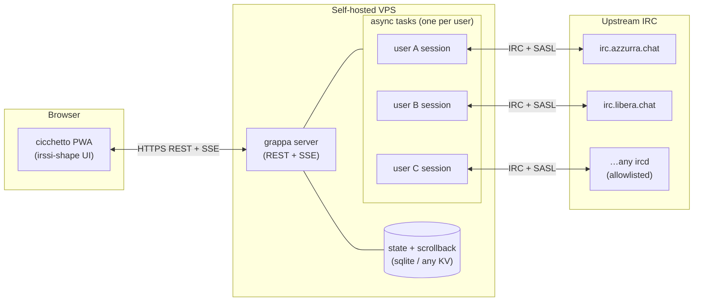

# grappa-irc

> An always-on IRC bouncer with a REST-first API and a browser PWA that looks like irssi.

## What

Two components, one monorepo:

- **grappa** — the server. Persistent bouncer, one async task per user, terminates IRC at the server boundary, exposes a clean REST API (plus SSE or WebSocket for event push). SASL bridging to upstream NickServ. Self-hostable on any VPS.
- **cicchetto** — the client. A PWA that speaks pure REST. Never parses IRC. Installable on mobile home screens. Visually irssi; mobile ergonomics added on top, not instead.

The pitch in one sentence: *modern IRC — always-on, consumable from a phone — without making it not-IRC.*

## Status

Pre-alpha. Not a line of code yet. **This README is the spec.** README-driven development.

## Why this exists

There are good IRC bouncers already. [soju](https://soju.im/) + [gamja](https://sr.ht/~emersion/gamja/) is the closest shape: a persistent Go bouncer + JS web client, both maintained by emersion, both excellent.

grappa-irc diverges on one deliberate axis: **the web client does not parse IRC**. soju and gamja communicate in IRC-framing-over-WebSocket — the client re-implements IRC protocol state in the browser. That's a principled choice and it buys standards-purity via IRCv3 extensions.

grappa makes the other choice: IRC terminates at the server, the client sees only REST resources (channels, messages, members, networks) and an event stream. The browser stays ignorant of IRC. Everything the client needs — scrollback pagination, channel modes, nick changes, join/part — arrives as typed JSON.

This also means grappa works against vanilla IRC servers. IRCv3 extensions are opportunistic bonuses where upstream supports them, not hard requirements. No CHATHISTORY needed: the bouncer owns scrollback.

## Architecture

- Each connected user has one persistent server-side task that owns their upstream IRC connection(s).
- The task streams IRC events into a per-user ring-buffer of scrollback (bounded, paginated).
- The REST surface is a thin read/write layer over that state. Writes (send message, join, part) translate to upstream IRC commands; reads return typed JSON.
- New events push to connected clients over SSE (or WebSocket if negotiated). Disconnected clients catch up on next connect via the paginated scrollback endpoints.

## Design principles

1. **No IRC parsing in the client. Ever.** REST is the contract. The browser never sees a raw `PRIVMSG`.
2. **IRCv3 is opportunistic, not required.** Works against any ircd that speaks `CAP LS` + SASL. Fancy extensions are bonuses.
3. **Scrollback is bouncer-owned.** Paginated API, client asks for more on scroll. No dependency on server-side `CHATHISTORY`.
4. **Auth is NickServ.** Login via SASL handshake against upstream. Registration proxied through a dedicated endpoint.
5. **Self-hostable.** Any VPS. sysadmin-configurable allowlist for upstream IRC servers.
6. **Irssi-shape on desktop, irssi-shape on mobile too.** Large screens nearly identical to irssi (themes + keybindings). Mobile keeps the same visual grammar but adds touch-ergonomic helpers (channel switcher, tap targets, soft keyboard handling). No chat-app metaphor — it's still IRC.
7. **No images, no voice, no file sharing.** It's IRC. Those problems belong to someone else.
8. **No mobile push infrastructure.** If the browser's PWA push API is available, we use it. Otherwise, no notifications. We don't run notification servers.

## REST surface (first draft)

All endpoints are authenticated except `POST /auth/login` and `POST /auth/register`.

| Method | Path | Purpose |
|--------|------|---------|
| `POST` | `/auth/login` | SASL-bridged login against a configured upstream network |
| `POST` | `/auth/register` | Proxy NickServ `REGISTER` on upstream |
| `POST` | `/auth/logout` | Invalidate session |
| `GET`  | `/me` | Current session info |
| `GET`  | `/networks` | Configured networks for current user |
| `POST` | `/networks` | Add a network binding |
| `DELETE` | `/networks/:net` | Remove a network binding |
| `GET`  | `/networks/:net/channels` | Joined channels on that network |
| `POST` | `/networks/:net/channels` | Join a channel |
| `DELETE` | `/networks/:net/channels/:chan` | Part |
| `GET`  | `/networks/:net/channels/:chan/messages?before=<ts>&limit=N` | Paginated scrollback |
| `POST` | `/networks/:net/channels/:chan/messages` | Send |
| `GET`  | `/networks/:net/channels/:chan/members` | Nicks + modes |
| `POST` | `/networks/:net/raw` | Escape hatch: send a raw IRC line |
| `GET`  | `/events` | SSE stream of new events (one endpoint, multiplexed) |

Events on `/events` are typed JSON — `message`, `join`, `part`, `quit`, `nick`, `mode`, `topic`, `notice`, etc. The client updates its local state from these; it does not need to reason about IRC framing.

## Scope

**In scope:**
- Text chat on IRC. Channels, queries, notices, CTCP ACTION.
- Multi-network per user.
- Persistent scrollback with pagination.
- NickServ authentication bridging.
- PWA that works on phones without an app-store detour.
- Self-hosting for individuals and small groups.

**Out of scope:**
- File sharing (DCC, HTTP uploads, anything).
- Voice, video, audio messages.
- Inline image/video/link unfurling beyond a URL as text.
- Running as a hosted multi-tenant SaaS. Self-hosted only.
- Push notification servers. PWA push only if the browser provides it.
- Being kinder to the ircd than the ircd is to itself.

## Prior art (read for behavior, not imported)

- [**soju**](https://soju.im/) — SASL bridging, scrollback ring-buffers, reconnect/backoff policy, multi-network management. The reference for "what a correct bouncer does".
- [**gamja**](https://sr.ht/~emersion/gamja/) — web-client login UX, channel-switch flow, PWA manifest. Visually not our target (chat-app shape), but the flows are instructive.
- [**The Lounge**](https://thelounge.chat/) — another working PWA reference. Bundles server + client, which is not our split, but the manifest + service-worker setup is canonical.
- [**IRCCloud**](https://www.irccloud.com/) — the commercial mobile-IRC UX north star. A "done" version of the experience we're aiming for.
- [**ZNC**](https://znc.in/) — the classic. Not an architectural reference, but every bouncer exists in dialogue with ZNC.

None of the above is being forked or imported. grappa is greenfield. The value here is reading their code for edge cases (retry logic, SASL negotiation nuances, scrollback eviction policy) and designing around the lessons.

## Why "grappa" and "cicchetto"

"Grappa" is Italian distillate — the direct homologue of Korean *soju*. "Cicchetto" is the small glass of wine, often accompanied by a bite, served at a *bàcaro* (a Venetian-style neighbourhood wine bar); parallel to *gamja*, the potato that accompanies soju in Korea. The naming is a deliberate riff on soju/gamja.

It is also a tribute: **Italian Grappa!** has been the call-sign of the [Italian Hackers' Embassy](https://events.ccc.de/camp/2019/wiki/Village:Italian_Hackers'_Embassy) at European hacker camps since 2001. The [Associazione Inclusive Hacker Framework](https://italiangrappa.it/) is the legal entity that carries the name today. This repository is not affiliated with that association; it borrows the cultural reference in the spirit it was intended — Italian hackers showing up somewhere with a bottle.

## Roadmap

### Phase 0 — spec (you are here)
- [x] README
- [ ] OpenAPI schema for the REST surface
- [ ] Pick a server language (Rust vs Go — decision pending)
- [ ] Pick a client framework (Svelte vs SolidJS vs plain lit-html)

### Phase 1 — server walking skeleton
- [ ] Single-user bouncer, single upstream network, hardcoded credentials
- [ ] Basic REST: `/networks`, `/channels`, `/messages` (paginated), `/events` (SSE)
- [ ] sqlite-backed scrollback
- [ ] Send + receive `PRIVMSG` round-trip

### Phase 2 — auth + multi-user
- [ ] SASL bridge for login
- [ ] NickServ `REGISTER` proxy
- [ ] Session tokens (short-lived + refresh)
- [ ] Per-user isolation

### Phase 3 — client walking skeleton
- [ ] PWA shell, manifest, service worker
- [ ] Login flow → token → connect `/events`
- [ ] Channel list + scrollback fetch on select
- [ ] Send message

### Phase 4 — irssi-shape UI
- [ ] Keyboard-first layout, theme system
- [ ] Nick list, mode indicators, topic bar
- [ ] Mobile ergonomics layer (touch helpers, not a different shape)

### Phase 5 — hardening
- [ ] Reconnect + backoff
- [ ] Scrollback eviction policy
- [ ] Allowlist configuration for upstream networks
- [ ] Docs for self-hosters

## Contributing

Pre-alpha. Issues welcome for design feedback on this spec; code PRs are deferred until Phase 1 lands.

## License

MIT — see [`LICENSE`](LICENSE).

## Author

[vjt](https://github.com/vjt) (Marcello Barnaba), who built [bahamut-inet6](https://github.com/vjt/azzurra-bahamut-inet6) and [suxserv](https://github.com/vjt/azzurra-suxserv) for the [Azzurra IRC network](https://www.azzurra.chat/). grappa-irc is the 2026 attempt at making Azzurra — and any IRC network — liveable on a phone.
