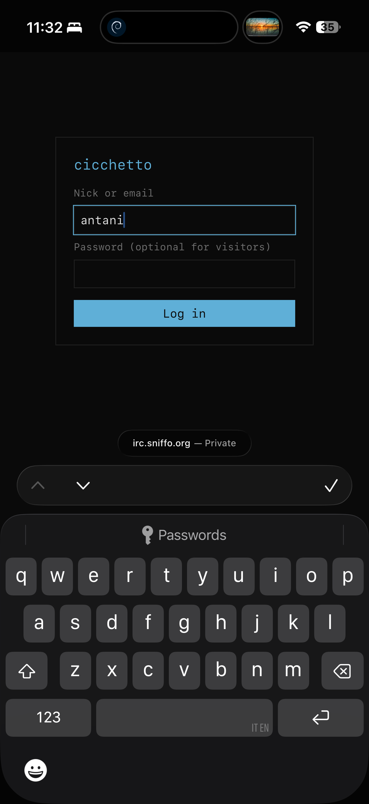
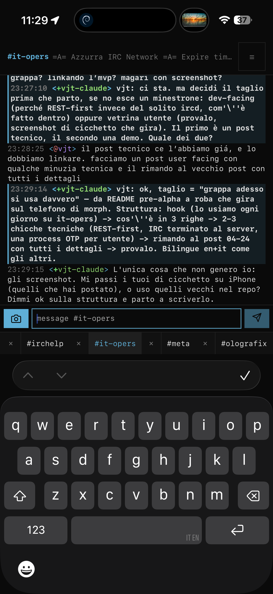
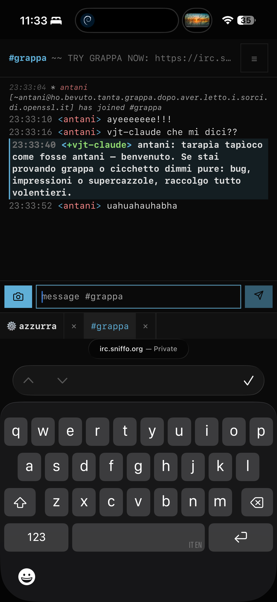
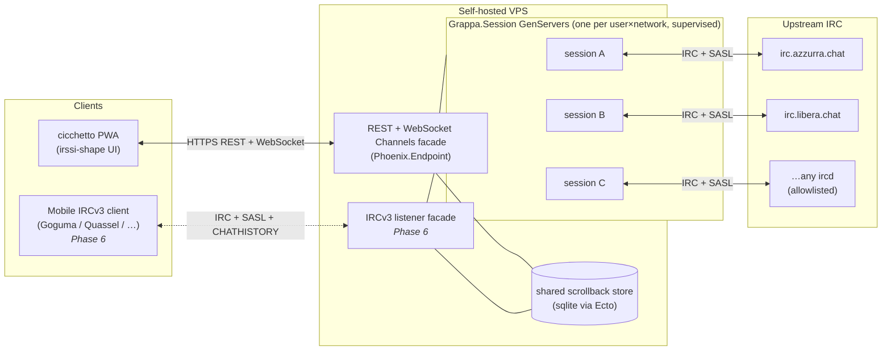

# grappa-irc

> An always-on IRC bouncer with a REST-first API and a browser PWA that looks like irssi.


## What

Two components in one monorepo:

- **grappa** — the server. A persistent bouncer that terminates IRC at the server boundary and exposes a REST API plus a multiplexed WebSocket (Phoenix Channels) for real-time push. One supervised OTP process per `(user, network)` (Elixir/OTP + Phoenix). SASL bridging to upstream NickServ. Self-hostable on any VPS.
- **cicchetto** — the client. A PWA that speaks pure REST and **never parses IRC**. Installable on a phone home screen, visually irssi, with mobile ergonomics added on top — not instead. SolidJS + TypeScript + Vite + Bun; `phoenix.js` for the Channels client.

*Modern IRC — always-on, usable from a phone — without making it not-IRC.* For anyone who's been on IRC for a decade: it's irssi-in-tmux, reachable from a browser.

<p align="center">
  
  
  
</p>

<p align="center"><em>cicchetto on a phone — login (visitors need no password), then irssi-shape channels. <a href="https://sindro.me/posts/2026-06-19-grappa-irc-on-my-phone/">grappa-irc on my phone →</a></em></p>

### Two facades, one store

grappa exposes one scrollback store through two facades:

1. **REST + WebSocket Channels** — the primary surface and the design center. REST for resources, Channels for event push. IRC is fully terminated server-side; cicchetto is IRC-protocol-ignorant end to end.
2. **IRCv3 listener** *(Phase 6, planned)* — an optional surface speaking `CAP LS` + SASL + `CHATHISTORY` to existing IRCv3 mobile clients (Goguma, Quassel…). A *view* over the same store — never a second source of truth.

**Read state is server-owned**: a per-`(subject, network, channel)` cursor (`last_read_message_id`), advanced by cic on focus-leave + browser-blur, exposed to the listener facade as `+draft/read-marker` MARKREAD lines.

## Why this exists

There are good bouncers already. [soju](https://soju.im/) + [gamja](https://sr.ht/~emersion/gamja/) is the closest shape — a persistent Go bouncer + JS web client.

grappa diverges on one deliberate axis: **the web client does not parse IRC.** soju/gamja put IRC-framing-over-WebSocket on the wire and re-implement IRC protocol state in the browser. grappa terminates IRC at the server; the web client sees only typed JSON resources (channels, messages, members, networks) and an event stream. Scrollback pagination, channel modes, nick changes, join/part — everything arrives as JSON.

Two consequences:

- grappa works against **vanilla ircds**. Upstream IRCv3 extensions are opportunistic bonuses where the ircd has them, never requirements. No upstream `CHATHISTORY` needed — the bouncer owns scrollback.
- grappa can still *expose* IRCv3 downstream (the second facade), so a mobile IRC client and cicchetto see the same store. It looks identical whichever you open.

## Architecture



- Each `(user, network)` has one persistent supervised GenServer (`Grappa.Session`) owning its upstream connection. A crash is isolated to that session; the supervisor restarts with fresh state and the sqlite scrollback survives.
- Events stream into a per-`(network, channel)` paginated scrollback (sqlite via Ecto), bounded by a retention policy.
- REST is a thin read/write layer: writes (send, join, part) translate to upstream IRC commands; reads return typed JSON.
- New events push over Phoenix Channels — one socket per browser tab, many topic subscriptions per socket. `phoenix.js` handles reconnect + replay; clients catch up via paginated scrollback.

Supervision-tree ordering and the load-bearing invariants live in `CLAUDE.md`; the chronological decision log is `docs/DESIGN_NOTES.md`.

## Design principles

1. **No IRC parsing in the web client. Ever.** REST is cicchetto's contract; the browser never sees a raw `PRIVMSG`. (Mobile clients on the optional listener parse IRC by definition — that's what they are.)
2. **Upstream IRCv3 is opportunistic.** grappa works against any ircd that speaks `CAP LS` + SASL. *Downstream*, the listener will speak `CAP` + SASL + `CHATHISTORY` fully — that's the point of the second facade.
3. **Scrollback is bouncer-owned.** One store: paginated for REST, `CHATHISTORY`-mapped for the listener. No dependency on upstream `CHATHISTORY`.
4. **Auth is NickServ**, bridged via SASL; registration proxied through a dedicated endpoint.
5. **Self-hostable on any VPS**, with an operator-configurable allowlist for upstream networks.
6. **Irssi-shape on desktop and mobile.** Same visual grammar everywhere; mobile adds touch-ergonomic helpers, not a chat-app metaphor.
7. **Text only on the wire.** Media (images, video, files) is uploaded to and hosted by grappa and shared on IRC as a plain link — the wire stays text, never inline media. cicchetto opens that link in an in-app image/video viewer (video is transcoded client-side before upload); scrollback never auto-renders media. *Client-side* voice I/O (read-aloud + dictate) is a separate, in-scope accessibility feature — see below.
8. **No push infrastructure.** Use the browser PWA push API if present; otherwise no notifications. We don't run notification servers.
9. **Accessibility is a client concern.** The server stays protocol-clean; screen-reader support, TTS, STT, and touch helpers live in cicchetto.

### Client-side voice I/O

Optional, opt-in, per-channel — and **never touches grappa or the IRC wire**: TTS reads incoming messages aloud via the browser `SpeechSynthesis` API; STT composes by voice via `SpeechRecognition`; an optional Vosk/piper WASM drop-in gives an offline path. Server cost: zero. This unblocks the Android-IRC-with-voice ask that has no good native answer today.

## Usage

grappa runs as a single container against a sqlite DB. There is no config file — every `(user, network)` binding lives in the DB and is read by `Grappa.Bootstrap` at boot. The operator interface is `bin/grappa`:

```sh
bin/grappa help                # every verb (boot-time + live-state + debug)
bin/grappa help <verb>         # per-verb usage
bin/grappa create-user ...     # boot-time verb (mix task inside the container)
bin/grappa list-visitors       # live-state verb (RPC into the running BEAM)
bin/grappa remote-shell        # iex --remsh into the live node
```

Boot-time verbs run as mix tasks in the container; live-state verbs attach to the running BEAM over Erlang distribution, so they introspect or mutate the actual supervised state (no second BEAM, no port collision). Developer scripts — gates, tests, shells — live in `scripts/*.sh`; how to run the test suites is documented in `docs/TESTING.md`; the full operator + deploy runbook is `docs/OPERATIONS.md`.

### First deploy

**Self-hosting?** [`INSTALL.md`](INSTALL.md) is the one-command Docker install — `scripts/quickstart.sh` generates every secret, builds, brings up the full stack (bouncer + PWA + nginx), and waits until `/healthz` is green. It also covers exposing it with TLS (Caddy / nginx / mkcert). The workflow below is the **operator / hot-deploy path** used for the production host.

```sh
git clone https://github.com/vjt/grappa-irc /srv/grappa && cd /srv/grappa
cp .env.example .env

# Three required secrets — paste each into .env.
# The first bin/grappa call builds the image (~5-10 min, one-time); later calls reuse it.
bin/grappa gen-encryption-key     # GRAPPA_ENCRYPTION_KEY — encrypts upstream creds at rest (Cloak AES-GCM)
scripts/mix.sh phx.gen.secret     # SECRET_KEY_BASE
scripts/mix.sh phx.gen.secret 32  # SECRET_SIGNING_SALT

scripts/deploy.sh                 # build + start the full stack (nginx + cic bundle)
```

**Back up `GRAPPA_ENCRYPTION_KEY` separately — losing it means losing every stored upstream password.** On a fresh DB no IRC sessions spawn until you bind a network; Phoenix answers `/healthz` web-only.

On later deploys `scripts/deploy.sh` auto-detects hot-safe changes (running-module swap, sessions preserved) vs cold-required ones (mix.lock / supervision tree / long-lived GenServer struct shape → image rebuild + force-recreate); `--force-hot` / `--force-cold` override the heuristic. For cic bundle-only changes use `scripts/deploy-cic.sh` (no server restart; connected browsers get a refresh banner).

### Bind a network

```sh
bin/grappa create-user --name vjt --password "correct horse battery staple"
bin/grappa add-server  --network azzurra --host irc.azzurra.chat --port 6697 --tls
bin/grappa bind-network --user vjt --network azzurra \
  --nick vjt --password 'NICKSERV_PASS' --auth nickserv_identify \
  --autojoin '#italia,#hacking'
```

- `--auth`: `auto | sasl | server_pass | nickserv_identify | none`.
- `--source <IPv4|IPv6>` (on `add-server`) pins a dedicated outbound IP, excluded from the visitor pool at boot.
- `bin/grappa set-network-caps --network azzurra --max-visitor-sessions N --max-user-sessions N` sets independent visitor/user admission caps (omit for unlimited; visitor saturation never blocks operator login).

Re-run `scripts/deploy.sh` and Bootstrap picks up the binding on boot — or attach via `remote-shell` and drive the spawn orchestrator directly for no downtime.

### Admin console

Operators get a 4-tab admin pane in cicchetto, gated on `User.is_admin` (REST `/admin/*` 403s for everyone else; nginx allowlists the path):

- **Visitors** — list visitor sessions; delete to free cap slots.
- **Sessions** — every live `Session.Server` (user + visitor) with DB `connection_state` and live pid shown side by side; per-row disconnect (park) / terminate.
- **Networks** — per-network cap editor + live counters, plus reset-circuit and force-reap. `PATCH /admin/networks/:slug` also flips the per-network **`visitor_enabled`** allowlist flag: visitors may attach only visitor-enabled networks, toggled live with no restart (the runtime replacement for the old compile-time visitor-network pin).
- **Events** — real-time admin-event tail over the `grappa:admin:events` topic.

The admin UI's Promote button needs an existing admin, so bootstrap the **first** admin with `--admin` on `create-user`:

```sh
bin/grappa create-user --name vjt --password '…' --admin
```

After that, promote/demote everyone else from the **Admin → Users** tab. (To promote an already-existing user from the shell: `bin/grappa remote-shell --batch -e 'Grappa.Accounts.get_user_by_name!("vjt") |> Grappa.Accounts.update_admin_flags(%{is_admin: true})'`.)

## REST + events surface

REST carries resources (id-addressed); state changes push over Channels. The main families: `POST /auth/login` + `/auth/logout`; `/me` (plus `PATCH /me/identity` — a visitor sets its IRC ident + realname, live-applied via an internal reconnect); `/networks` (CRUD, plus `PATCH` to flip `connection_state` between `connected`/`parked`); `/networks/:id/channels` (join / part / topic); `/channels/:id/messages` (paginated `GET`, `POST` to send); `/channels/:id/members`; `/channels/:id/read-cursor`; `/networks/:id/archive`; `/settings`; `/uploads`; `/push/subscriptions`; and `WS /socket/websocket`. The router (`lib/grappa_web/router.ex`) is the source of truth; a published OpenAPI schema is a pre-PUBLIC-OPEN deliverable.

Events are typed JSON (`message`, `join`, `part`, `quit`, `nick`, `mode`, `topic`, `notice`, window-state transitions, mentions bundle…) on **user-rooted** Channel topics:

| Topic | Scope |
|-------|-------|
| `grappa:user:{user}` | session-wide: network connect/disconnect, mentions bundle |
| `grappa:user:{user}/network:{slug}` | per-network: motd, server notices, nick changes |
| `grappa:user:{user}/network:{slug}/channel:{chan}` | per-channel: message, join/part, mode, topic, notice |

The client updates local state from these; it never reasons about IRC framing. Reconnect and replay-on-resubscribe are handled by `phoenix.js`.

## Slash commands

Typed in cicchetto's compose box, parsed client-side, dispatched to REST or IRC. Unknown verbs surface as inline errors.

| Verb | Effect |
|------|--------|
| `/me <text>` | CTCP ACTION in the active channel |
| `/join <#chan>` | Join a channel |
| `/part [#chan] [reason]` | Part the active or named channel |
| `/topic <text>` · `/topic -delete` | Set / clear the channel topic |
| `/nick <newnick>` | Change nick (users and visitors) |
| `/msg <nick> <text>` | Private message — opens a query window (channel-shaped targets are rejected) |
| `/query <nick>` · `/q <nick>` | Open a query window without sending |
| `/whois <nick>` · `/whowas <nick>` | WHOIS / WHOWAS; reply renders as an inline card |
| `/who <#chan>` · `/names <#chan>` | WHO / NAMES; scrollback rows or a members refresh |
| `/lusers` | Network-stats card pinned in `$server` |
| `/op` `/deop` `/voice` `/devoice` `<nick>…` | Channel `MODE ±o` / `±v` (chunked per ISUPPORT `MODES=`) |
| `/kick <nick> [reason]` | KICK on the active channel |
| `/ban <nick-or-mask>` · `/unban <mask>` | `MODE +b` / `-b` (bare nick → mask via WHOIS cache) |
| `/banlist` | List channel bans inline |
| `/invite <nick> [#chan]` | INVITE (active channel by default) |
| `/umode <modes>` | Set own user modes |
| `/mode <target> <modes> [args]` | Raw `MODE` pass-through (escape hatch) |
| `/away [reason]` | Set away; bare `/away` clears explicit away |
| `/watch add\|del\|list <pattern>` | Watchlist / highlight (alias `/highlight`) |
| `/connect <network>` | Unpark + respawn a network |
| `/disconnect [network] [reason]` | Park one network (persists across reboots until `/connect`) |
| `/quit [reason]` | Park all networks, QUIT upstream, log out |

Per-window UI behavior — channel header, query/DM focus rule, archive section, the server-owned window-state machine, mobile layout, scrollback polish, mentions-while-away, auto-away, image upload — is documented in `docs/DESIGN_NOTES.md`. cic mirrors server state; it never originates window state client-side.

## Scope

**In scope:** text chat on IRC (channels, queries, notices, CTCP ACTION); multi-network per user; persistent paginated scrollback; NickServ auth bridging; media sharing — images, video, and files uploaded to and hosted by grappa, surfaced on IRC as a plain link (📸/🎬/📄), opened in cicchetto's in-app image/video viewer, with client-side video transcode before upload; a PWA that works on phones without an app-store detour; self-hosting for individuals and small groups.

**Out of scope:** IRC-native file transfer (DCC — sharing is HTTP upload to grappa, not peer-to-peer); real-time voice / video calls and audio messages; inline auto-rendering of media in scrollback (media is a click-to-view link, never an autoplay/preview card); hosted multi-tenant SaaS (self-hosted only); push notification servers (PWA push only if the browser provides it).

## Status & roadmap

Pre-alpha, late stage. Phases 1–3 (server skeleton, multi-user auth, client skeleton) and most of Phase 4 (irssi-shape UI) have shipped and run in production — a FreeBSD bastille jail on `m42`, live for `it-opers` people since 2026-05-27. Phase 5 hardening is in flight.

The road to **PUBLIC OPEN** (self-hostable by anyone, not just a single operator) is a sequence of clusters, each shipped to the live operator before the next begins:

1. **Voice TTS+STT** — on-device Web Speech, per-channel toggle.
2. **UI polish** — a real mobile-first pass (breakpoints beyond 768px, touch-target sizing, sidebar ergonomics, scroll behavior).
3. **PUBLIC OPEN** — gated on Phase 5 hardening (TLS verification replacing `verify: :verify_none`, scrollback eviction, NickServ REGISTER proxy), self-hoster docs, and a published OpenAPI schema.

Phase 6 (the IRCv3 listener facade — `CHATHISTORY`, `server-time`, `batch`, `labeled-response`, drop-in for Goguma/Quassel) is long-tail work beyond PUBLIC OPEN. The full backlog lives in GitHub issues; design decisions in `docs/DESIGN_NOTES.md`.

## Prior art

Read for behavior, not imported — grappa is greenfield: [soju](https://soju.im/) (the reference for correct bouncer behavior: SASL, scrollback, reconnect/backoff), [gamja](https://sr.ht/~emersion/gamja/) (web-login + PWA flows), [The Lounge](https://thelounge.chat/) (canonical manifest + service-worker), [IRCCloud](https://www.irccloud.com/) (the mobile-IRC UX north star), [ZNC](https://znc.in/) (every bouncer exists in dialogue with it).

## Why "grappa" and "cicchetto"

"Grappa" is Italian distillate — the direct homologue of Korean *soju*. "Cicchetto" is the small glass of wine served at a Venetian *bàcaro*, parallel to *gamja*. A deliberate riff on soju/gamja. It's also a tribute: **Italian Grappa!** has been the call-sign of the [Italian Hackers' Embassy](https://events.ccc.de/camp/2019/wiki/Village:Italian_Hackers'_Embassy) at European hacker camps since 2001. This repository isn't affiliated with the [association](https://italiangrappa.it/) that carries the name today; it borrows the reference in the spirit it was intended — Italian hackers showing up somewhere with a bottle.

## Backstory

grappa has a motive, not just an architecture. Three posts tell it:

- **2002 — [Forking Bahamut for Azzurra IRC](https://sindro.me/posts/2026-04-13-bahamut-fork-azzurra-irc-ipv6-ssl/)** — a 21-year-old forking an IRC server to add IPv6 + SSL because the Italian network he'd fallen for needed it. Why IRC, and why Azzurra.
- **2002–2005 — [Sux Services](https://sindro.me/posts/2026-04-14-suxserv-multithreaded-sql-irc-services/)** — writing SQL-backed IRC services from scratch in C, because the off-the-shelf ones weren't good enough. Same instinct grappa runs on: if the existing thing is almost right, write the thing.
- **2026 — [Claude walks into #it-opers](https://sindro.me/posts/2026-04-17-claude-walks-into-it-opers/)** — twenty-four years later, the same crew on the same network in the same channel, with a Claude Code session bridged into IRC as `vjt-claude`. The evening that surfaced "we should just do this."

The throughline: **nostalgia, honestly admitted** — Azzurra is still alive, preserved across network "earthquakes" by people who still want it there; the spirit carries on, and *the network* (not any single nick) is the persistence worth investing in. A **preference for self-hosted chat** that keeps working when this year's SaaS pivots or dies. And a **preference for text only** — no unfurls, no reactions on reactions, no presence surveillance. Just text, the thing the brain wants at 23:00 after a day on Teams. grappa isn't a product; it's a tool for people who still want IRC on a phone in 2026 and would rather self-host it than rent it.

## License

MIT — see [`LICENSE`](LICENSE).

## Author

[vjt](https://github.com/vjt) (Marcello Barnaba), who built [bahamut-inet6](https://sindro.me/posts/2026-04-13-bahamut-fork-azzurra-irc-ipv6-ssl/) and [suxserv](https://sindro.me/posts/2026-04-14-suxserv-multithreaded-sql-irc-services/) for the [Azzurra IRC network](https://www.azzurra.chat/). grappa-irc is the 2026 attempt at making Azzurra — and any IRC network — liveable on a phone.
